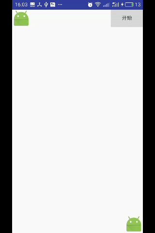

#贝塞尔曲线购物车动画

实现效果  

```java
package com.nurmemet.bezeircurve;

import android.animation.Animator;
import android.animation.ValueAnimator;
import android.content.Context;
import android.graphics.Path;
import android.graphics.PathMeasure;
import android.graphics.PointF;
import android.view.ViewGroup;
import android.widget.ImageView;
import android.widget.LinearLayout;

/**
 * Created by nurmemet on 10/16/2016.
 */

public class ThrowAnim {

    private static final boolean isDebug = false;
    private ImageView mAnimItem;
    private int mDuration = 1000;
    private PointF mStart;
    private PointF mEnd;

    private ViewGroup mContentView;
    private Context mContext;
    private int mContentTop;
    private Path mPath;
    private PathMeasure mPathMeasuer;
    private float[] mDesPoint = new float[2];

    private ThrowListener mOnThrowListener;

    public void setOnThrowListener(ThrowListener onThrowListener) {
        this.mOnThrowListener = onThrowListener;
    }

    public ThrowAnim(Context mContext, ViewGroup contentView, PointF mEnd, PointF mStart) {
        this.mContext = mContext;
        this.mContentView = contentView;
        this.mEnd = mEnd;
        this.mStart = mStart;
        mPath = new Path();
        mPathMeasuer = new PathMeasure();
    }

    public void move() {
        mPath.reset();
        mPath.moveTo(mStart.x, mStart.y);
        mPath.quadTo(mEnd.x, mStart.y, mEnd.x, mEnd.y);
        mPathMeasuer.setPath(mPath, false);
        int[] contentL = new int[2];
        mContentView.getLocationInWindow(contentL);
        mContentTop = contentL[1];
        mAnimItem = new ImageView(mContext);
        mAnimItem.setImageResource(R.mipmap.ic_launcher);
        mContentView.addView(mAnimItem, new LinearLayout.LayoutParams(LinearLayout.LayoutParams.WRAP_CONTENT, LinearLayout.LayoutParams.WRAP_CONTENT));
        final ValueAnimator anim = ValueAnimator.ofFloat(0, 1);
        anim.addUpdateListener(new ValueAnimator.AnimatorUpdateListener() {
            @Override
            public void onAnimationUpdate(ValueAnimator animation) {
                final float value = (float) animation.getAnimatedValue();
                final float length = mPathMeasuer.getLength();
                mPathMeasuer.getPosTan(length * value, mDesPoint, null);
            }
        });
        anim.setDuration(mDuration);
        anim.addUpdateListener(new ValueAnimator.AnimatorUpdateListener() {
            @Override
            public void onAnimationUpdate(ValueAnimator animation) {

                mAnimItem.setTranslationX(mDesPoint[0]);
                mAnimItem.setTranslationY(mDesPoint[1] - mContentTop);
            }
        });
        anim.addListener(new Animator.AnimatorListener() {
            @Override
            public void onAnimationStart(Animator animation) {

            }

            @Override
            public void onAnimationEnd(Animator animation) {
                mContentView.removeView(mAnimItem);
                if (mOnThrowListener != null) {
                    mOnThrowListener.onThrowEnd();
                }
            }

            @Override
            public void onAnimationCancel(Animator animation) {

            }

            @Override
            public void onAnimationRepeat(Animator animation) {

            }
        });
        anim.start();
    }


    public interface ThrowListener {
        void onThrowEnd();
    }
}

```
activity代码
```java
package com.nurmemet.bezeircurve;

import android.app.Activity;
import android.graphics.PointF;
import android.os.Bundle;
import android.view.View;
import android.view.ViewGroup;

/**
 * Created by nurmemet on 10/16/2016.
 */

public class AnimAct extends Activity {
    private View mStartView;
    private View mEndView;

    @Override
    protected void onCreate(Bundle savedInstanceState) {
        super.onCreate(savedInstanceState);
        setContentView(R.layout.layout_anim);
        mStartView = findViewById(R.id.start_);
        mEndView = findViewById(R.id.end_);

    }

    public void onThrow(View view) {

        int[] start = new int[2];
        mStartView.getLocationInWindow(start);
        int[] end = new int[2];
        mEndView.getLocationInWindow(end);
        ThrowAnim mThrower = new ThrowAnim(this, (ViewGroup) findViewById(android.R.id.content), new PointF(end[0], end[1]), new PointF(start[0], start[1]));
        mThrower.setOnThrowListener(new ThrowAnim.ThrowListener() {
            @Override
            public void onThrowEnd() {

            }
        });
        mThrower.move();
    }
}

```

1. 主要用到函数mPathMeasuer.getPosTan(length * value, mDesPoint, null);路径上寻找指定位置的点的坐标mDesPoint是大小为
2的数组  
2. activity内容容器android.R.id.content  
3. getLocationInWindow函数
