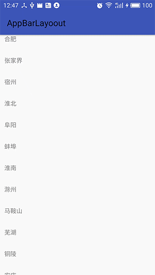

#CoordinateLayout,AppBarLayout滚动原理与源码分析


效果图  


```xml
<?xml version="1.0" encoding="utf-8"?>
<android.support.design.widget.CoordinatorLayout
    xmlns:android="http://schemas.android.com/apk/res/android"
    xmlns:app="http://schemas.android.com/apk/res-auto"
    xmlns:tools="http://schemas.android.com/tools"
    android:layout_width="match_parent"
    android:layout_height="match_parent"
    android:orientation="vertical"
    tools:context="com.example.nurmemet.appbarlayoout.MainActivity"
    >

    <android.support.design.widget.AppBarLayout
        android:id="@+id/app_bar_layout"
        android:layout_width="match_parent"
        android:layout_height="wrap_content"
        android:orientation="vertical"
        >

        <android.support.v7.widget.Toolbar
            android:id="@+id/tool_bar"
            android:layout_width="match_parent"
            android:layout_height="?actionBarSize"
            app:layout_scrollFlags="scroll"
            >
        </android.support.v7.widget.Toolbar>
    </android.support.design.widget.AppBarLayout>


    <android.support.v7.widget.RecyclerView
        android:id="@+id/recycle_view"
        android:layout_width="match_parent"
        android:layout_height="match_parent"
        app:layout_behavior="@string/appbar_scrolling_view_behavior"
        ></android.support.v7.widget.RecyclerView>

</android.support.design.widget.CoordinatorLayout>

```


```java
package com.example.nurmemet.appbarlayoout;

import android.content.Context;
import android.os.Bundle;
import android.support.design.widget.AppBarLayout;
import android.support.v7.app.AppCompatActivity;
import android.support.v7.widget.LinearLayoutManager;
import android.support.v7.widget.RecyclerView;
import android.support.v7.widget.Toolbar;
import android.view.LayoutInflater;
import android.view.View;
import android.view.ViewGroup;
import android.widget.TextView;

public class MainActivity extends AppCompatActivity {

    Toolbar mToolBar;
    RecyclerView mRecycleView;
    Adapter mAdapter;
    AppBarLayout mAppbarLayout;


    @Override
    protected void onCreate(Bundle savedInstanceState) {
        super.onCreate(savedInstanceState);
        setContentView(R.layout.activity_main_);
        mToolBar = (Toolbar) findViewById(R.id.tool_bar);
        setSupportActionBar(mToolBar);
        mRecycleView = (RecyclerView) findViewById(R.id.recycle_view);
        mAdapter = new Adapter(this, stringCitys);
        LinearLayoutManager manager = new LinearLayoutManager(this);
        manager.setOrientation(LinearLayoutManager.VERTICAL);
        mRecycleView.setLayoutManager(manager);
        mRecycleView.setAdapter(mAdapter);

        mAppbarLayout = (AppBarLayout) findViewById(R.id.app_bar_layout);
        mRecycleView.addOnScrollListener(new RecyclerView.OnScrollListener() {
            @Override
            public void onScrollStateChanged(RecyclerView recyclerView, int newState) {
                super.onScrollStateChanged(recyclerView, newState);
            }
        });


    }

    public static String[] stringCitys = new String[]{
            "合肥", "张家界", "宿州", "淮北", "阜阳", "蚌埠", "淮南", "滁州",
            "马鞍山", "芜湖", "铜陵", "安庆", "安阳", "黄山", "六安", "巢湖",
            "池州", "宣城", "亳州", "明光", "天长", "桐城", "宁国",
            "徐州", "连云港", "宿迁", "淮安", "盐城", "扬州", "泰州",
            "南通", "镇江", "常州", "无锡", "苏州", "江阴", "宜兴",
            "邳州", "新沂", "金坛", "溧阳", "常熟", "张家港", "太仓",
            "昆山", "吴江", "如皋", "通州", "海门", "启东", "大丰",
            "东台", "高邮", "仪征", "江都", "扬中", "句容", "丹阳",
            "兴化", "姜堰", "泰兴", "靖江", "福州", "南平", "三明",
            "复兴", "高领", "共兴", "柯家寨", "匹克", "匹夫", "旗舰", "启航",
            "如阳", "如果", "科比", "韦德", "诺维斯基", "麦迪", "乔丹", "姚明"
    };

    static class Adapter extends RecyclerView.Adapter<Adapter.CustomViewHolder> {
        private Context mContext;
        private String[] mArray;

        public Adapter(Context mContext, String[] mArray) {
            this.mContext = mContext;
            this.mArray = mArray;
        }

        @Override
        public CustomViewHolder onCreateViewHolder(ViewGroup parent, int viewType) {
            View view = LayoutInflater.from(mContext).inflate(R.layout.item_list, parent, false);
            return new CustomViewHolder(view);
        }

        @Override
        public void onBindViewHolder(CustomViewHolder holder, int position) {
            holder.mTextView.setText(mArray[position]);
        }

        @Override
        public int getItemCount() {
            if (mArray != null) {
                return mArray.length;
            }
            return 0;
        }

        static class CustomViewHolder extends RecyclerView.ViewHolder {
            public TextView mTextView;

            public CustomViewHolder(View itemView) {
                super(itemView);
                mTextView = (TextView) itemView.findViewById(R.id.name);
            }
        }
    }
}


```

RecycleView,CoordinateView,AppBarLayout之间的交互过程

首先是从RecycleView的OnTouchEvent开始

```java
 case MotionEvent.ACTION_DOWN: {
                mScrollPointerId = e.getPointerId(0);
                mInitialTouchX = mLastTouchX = (int) (e.getX() + 0.5f);
                mInitialTouchY = mLastTouchY = (int) (e.getY() + 0.5f);

                int nestedScrollAxis = ViewCompat.SCROLL_AXIS_NONE;
                if (canScrollHorizontally) {
                    nestedScrollAxis |= ViewCompat.SCROLL_AXIS_HORIZONTAL;
                }
                if (canScrollVertically) {
                    nestedScrollAxis |= ViewCompat.SCROLL_AXIS_VERTICAL;
                }
                startNestedScroll(nestedScrollAxis);
            } break;

```

startNestedScroll是NestedScrollingChild里的函数
```java
 @Override
public boolean startNestedScroll(int axes) {
    return getScrollingChildHelper().startNestedScroll(axes);
}
```
NestedScrollingChildHelper是个辅助类

```java
 public boolean startNestedScroll(int axes) {
        if (hasNestedScrollingParent()) {
            // Already in progress
            return true;
        }
        if (isNestedScrollingEnabled()) {
            ViewParent p = mView.getParent();
            View child = mView;
            while (p != null) {
                if (ViewParentCompat.onStartNestedScroll(p, child, mView, axes)) {
                    mNestedScrollingParent = p;
                    ViewParentCompat.onNestedScrollAccepted(p, child, mView, axes);
                    return true;
                }
                //注意此处child参数的变化，通过下面的代码可以看出child是抱着recycleview的CoordinateLayout的直接子View
                if (p instanceof View) {
                    child = (View) p;
                }
                p = p.getParent();
            }
        }
        return false;
    }
```

```java
//此时parent是CoordinateLayout,child是recycleview,target也是recycleView,nestedScrollAxes是滚动方向
public static boolean onStartNestedScroll(ViewParent parent, View child, View target,
            int nestedScrollAxes) {
        try {
            return parent.onStartNestedScroll(child, target, nestedScrollAxes);
        } catch (AbstractMethodError e) {
            Log.e(TAG, "ViewParent " + parent + " does not implement interface " +
                    "method onStartNestedScroll", e);
            return false;
        }
    }

```
下面回到CoordinateLayout中的处理过程,上面方法是调用了CoordinateLayout的onStartNestedScroll方法，看下源码
```java
//函数各个参数的含义跟上面一样，这个函数是遍历直接子节点，寻找处理NestedScrolling的对象，这里还有一个问题
//就是观察下面的函数发现，遍历过在寻找behavior，那么直接子节点的behavior是什么时候赋值的
@Override
public boolean onStartNestedScroll(View child, View target, int nestedScrollAxes) {
    boolean handled = false;

    final int childCount = getChildCount();
    for (int i = 0; i < childCount; i++) {
        final View view = getChildAt(i);
        final LayoutParams lp = (LayoutParams) view.getLayoutParams();
        final Behavior viewBehavior = lp.getBehavior();
        if (viewBehavior != null) {
            final boolean accepted = viewBehavior.onStartNestedScroll(this, view, child, target,
                    nestedScrollAxes);
            handled |= accepted;

            lp.acceptNestedScroll(accepted);
        } else {
            lp.acceptNestedScroll(false);
        }
    }
    return handled;
}

```
源码里面有两个地方赋值behavior,一个是recycleview的hevior的赋值过程
```java
public LayoutParams(int width, int height) {
            super(width, height);
        }

    LayoutParams(Context context, AttributeSet attrs) {
        super(context, attrs);

        final TypedArray a = context.obtainStyledAttributes(attrs,
                R.styleable.CoordinatorLayout_Layout);

        this.gravity = a.getInteger(
                R.styleable.CoordinatorLayout_Layout_android_layout_gravity,
                Gravity.NO_GRAVITY);
        mAnchorId = a.getResourceId(R.styleable.CoordinatorLayout_Layout_layout_anchor,
                View.NO_ID);
        this.anchorGravity = a.getInteger(
                R.styleable.CoordinatorLayout_Layout_layout_anchorGravity,
                Gravity.NO_GRAVITY);

        this.keyline = a.getInteger(R.styleable.CoordinatorLayout_Layout_layout_keyline,
                -1);

        insetEdge = a.getInt(R.styleable.CoordinatorLayout_Layout_layout_insetEdge, 0);
        dodgeInsetEdges = a.getInt(
                R.styleable.CoordinatorLayout_Layout_layout_dodgeInsetEdges, 0);
                //recycleview 的behavior是在这里赋值的，是载入布局的时候
        mBehaviorResolved = a.hasValue(
                R.styleable.CoordinatorLayout_Layout_layout_behavior);
        if (mBehaviorResolved) {
            mBehavior = parseBehavior(context, attrs, a.getString(
                    R.styleable.CoordinatorLayout_Layout_layout_behavior));
        }
        a.recycle();

        if (mBehavior != null) {
            // If we have a Behavior, dispatch that it has been attached
            mBehavior.onAttachedToLayoutParams(this);
        }
    }
```
还有一个，在onMeasure->prepareChildren函数里面
```java
private void prepareChildren() {
    mDependencySortedChildren.clear();
    mChildDag.clear();

    for (int i = 0, count = getChildCount(); i < count; i++) {
        final View view = getChildAt(i);

        final LayoutParams lp = getResolvedLayoutParams(view);
        lp.findAnchorView(this, view);

        mChildDag.addNode(view);

        // Now iterate again over the other children, adding any dependencies to the graph
        for (int j = 0; j < count; j++) {
            if (j == i) {
                continue;
            }
            final View other = getChildAt(j);
            final LayoutParams otherLp = getResolvedLayoutParams(other);
            if (otherLp.dependsOn(this, other, view)) {
                if (!mChildDag.contains(other)) {
                    // Make sure that the other node is added
                    mChildDag.addNode(other);
                }
                // Now add the dependency to the graph
                mChildDag.addEdge(view, other);
            }
        }
    }

    // Finally add the sorted graph list to our list
    mDependencySortedChildren.addAll(mChildDag.getSortedList());
    // We also need to reverse the result since we want the start of the list to contain
    // Views which have no dependencies, then dependent views after that
    Collections.reverse(mDependencySortedChildren);
    }
```
看看getResolvedLayoutParams源码
```java
LayoutParams getResolvedLayoutParams(View child) {
    final LayoutParams result = (LayoutParams) child.getLayoutParams();
    if (!result.mBehaviorResolved) {
        Class<?> childClass = child.getClass();

        DefaultBehavior defaultBehavior = null;
        //根据注解获取对应的hehavior，AppBarLayout的hehavior是通过注解定义的
        while (childClass != null &&
                (defaultBehavior = childClass.getAnnotation(DefaultBehavior.class)) == null) {
            childClass = childClass.getSuperclass();
        }
        if (defaultBehavior != null) {
            try {
                result.setBehavior(defaultBehavior.value().newInstance());
            } catch (Exception e) {
                Log.e(TAG, "Default behavior class " + defaultBehavior.value().getName() +
                        " could not be instantiated. Did you forget a default constructor?", e);
            }
        }
        result.mBehaviorResolved = true;
    }
    return result;
}

```
AppBarLayoutde的Behavior的注解定义
```java
//CoordinateLayout是根据这个注解获取behavior的
@CoordinatorLayout.DefaultBehavior(AppBarLayout.Behavior.class)
public class AppBarLayout extends LinearLayout {
}

```
下面回到CoordinateLayotu的onStartNestedScroll函数
```java
@Override
public boolean onStartNestedScroll(View child, View target, int nestedScrollAxes) {
    boolean handled = false;

    final int childCount = getChildCount();
    for (int i = 0; i < childCount; i++) {
        final View view = getChildAt(i);
        final LayoutParams lp = (LayoutParams) view.getLayoutParams();
        final Behavior viewBehavior = lp.getBehavior();
        if (viewBehavior != null) {
            final boolean accepted = viewBehavior.onStartNestedScroll(this, view, child, target,
                    nestedScrollAxes);
            handled |= accepted;

            lp.acceptNestedScroll(accepted);
        } else {
            lp.acceptNestedScroll(false);
        }
    }
    return handled;
}

```

根据本例的布局，CoordinateLayout的第一个子布局是AppBarLayout而且他的Behavior的定义我们也知道了，下面看看Behavior的处理过程  
注意AppBarLayout里面有两个Behavior，一个是在布局里面为RecycleView指定的ScrollingViewBehavior，一个是为AppBarLayout指定的Behavior  
两个类同样实现了CoordinateLayotu的Behavior接口，只是这两个实现方式不同，决定AppBarLayout和RecycleView不同的行为,看看CoordinateLayout的Behavior接口的定义,有几个方式跟NestedScrollingParent,NestedScrollingChild的差不多，函数参数也是差不多的
```java
public static abstract class Behavior<V extends View> {

        public Behavior() {
        }

    
        public Behavior(Context context, AttributeSet attrs) {
        }

        public void onAttachedToLayoutParams(@NonNull CoordinatorLayout.LayoutParams params) {
        }

        public void onDetachedFromLayoutParams() {
        }

        public boolean onInterceptTouchEvent(CoordinatorLayout parent, V child, MotionEvent ev) {
            return false;
        }

        public boolean onTouchEvent(CoordinatorLayout parent, V child, MotionEvent ev) {
            return false;
        }

        @ColorInt
        public int getScrimColor(CoordinatorLayout parent, V child) {
            return Color.BLACK;
        }

        @FloatRange(from = 0, to = 1)
        public float getScrimOpacity(CoordinatorLayout parent, V child) {
            return 0.f;
        }

    
        public boolean blocksInteractionBelow(CoordinatorLayout parent, V child) {
            return getScrimOpacity(parent, child) > 0.f;
        }

        public boolean layoutDependsOn(CoordinatorLayout parent, V child, View dependency) {
            return false;
        }

        public boolean onDependentViewChanged(CoordinatorLayout parent, V child, View dependency) {
            return false;
        }

    
        public void onDependentViewRemoved(CoordinatorLayout parent, V child, View dependency) {
        }

        @Deprecated
        public boolean isDirty(CoordinatorLayout parent, V child) {
            return false;
        }

        public boolean onMeasureChild(CoordinatorLayout parent, V child,
                int parentWidthMeasureSpec, int widthUsed,
                int parentHeightMeasureSpec, int heightUsed) {
            return false;
        }

        public boolean onLayoutChild(CoordinatorLayout parent, V child, int layoutDirection) {
            return false;
        }

        public static void setTag(View child, Object tag) {
            final LayoutParams lp = (LayoutParams) child.getLayoutParams();
            lp.mBehaviorTag = tag;
        }

        public static Object getTag(View child) {
            final LayoutParams lp = (LayoutParams) child.getLayoutParams();
            return lp.mBehaviorTag;
        }

        public boolean onStartNestedScroll(CoordinatorLayout coordinatorLayout,
                V child, View directTargetChild, View target, int nestedScrollAxes) {
            return false;
        }

    
        public void onNestedScrollAccepted(CoordinatorLayout coordinatorLayout, V child,
                View directTargetChild, View target, int nestedScrollAxes) {
            // Do nothing
        }

    
        public void onStopNestedScroll(CoordinatorLayout coordinatorLayout, V child, View target) {
            // Do nothing
        }

    
        public void onNestedScroll(CoordinatorLayout coordinatorLayout, V child, View target,
                int dxConsumed, int dyConsumed, int dxUnconsumed, int dyUnconsumed) {
            // Do nothing
        }

        public void onNestedPreScroll(CoordinatorLayout coordinatorLayout, V child, View target,
                int dx, int dy, int[] consumed) {
            // Do nothing
        }

    
        public boolean onNestedFling(CoordinatorLayout coordinatorLayout, V child, View target,
                float velocityX, float velocityY, boolean consumed) {
            return false;
        }

    
        public boolean onNestedPreFling(CoordinatorLayout coordinatorLayout, V child, View target,
                float velocityX, float velocityY) {
            return false;
        }

        @NonNull
        public WindowInsetsCompat onApplyWindowInsets(CoordinatorLayout coordinatorLayout,
                V child, WindowInsetsCompat insets) {
            return insets;
        }

       
        public boolean onRequestChildRectangleOnScreen(CoordinatorLayout coordinatorLayout,
                V child, Rect rectangle, boolean immediate) {
            return false;
        }

      
        public void onRestoreInstanceState(CoordinatorLayout parent, V child, Parcelable state) {
            // no-op
        }

        
        public Parcelable onSaveInstanceState(CoordinatorLayout parent, V child) {
            return BaseSavedState.EMPTY_STATE;
        }


        public boolean getInsetDodgeRect(@NonNull CoordinatorLayout parent, @NonNull V child,
                @NonNull Rect rect) {
            return false;
        }
    }

```

下面看看AppBarLayoutBehavior的Behavior类的onStartNestedScroll
```java
@Override
public boolean onStartNestedScroll(CoordinatorLayout parent, AppBarLayout child,
        View directTargetChild, View target, int nestedScrollAxes) {
    // Return true if we're nested scrolling vertically, and we have scrollable children
    // and the scrolling view is big enough to scroll
    //判断滚动方向
    //判断有没有滚动的空间，这里还有一个函数比较关键，也就是hasScrollableChildren()
    final boolean started = (nestedScrollAxes & ViewCompat.SCROLL_AXIS_VERTICAL) != 0
            && child.hasScrollableChildren()
            && parent.getHeight() - directTargetChild.getHeight() <= child.getHeight();

    if (started && mOffsetAnimator != null) {
        // Cancel any offset animation
        mOffsetAnimator.cancel();
    }

    // A new nested scroll has started so clear out the previous ref
    mLastNestedScrollingChildRef = null;

    return started;
}
```

```java
boolean hasScrollableChildren() {
    return getTotalScrollRange() != 0;
}

```

```java
 public final int getTotalScrollRange() {
    if (mTotalScrollRange != INVALID_SCROLL_RANGE) {
        return mTotalScrollRange;
    }

    //注意下面的循环遍历过程，首先是取出AppBarLayout的直接子View的LayoutParams
    //判断它有没有SCROLL_FLAG_SCROLL标志也就是布局里面定义的layout_scrollFlags属性
    //如果没有，直接退出循环，函数直接返回，意思是如果你在布局里面AppBarLayout的里面的
    //第一个View有没有layout_scrollFlags属性是关键，无论它是什么View
    int range = 0;
    for (int i = 0, z = getChildCount(); i < z; i++) {
        final View child = getChildAt(i);
        final LayoutParams lp = (LayoutParams) child.getLayoutParams();
        final int childHeight = child.getMeasuredHeight();
        final int flags = lp.mScrollFlags;

        if ((flags & LayoutParams.SCROLL_FLAG_SCROLL) != 0) {
            // We're set to scroll so add the child's height
            range += childHeight + lp.topMargin + lp.bottomMargin;

            if ((flags & LayoutParams.SCROLL_FLAG_EXIT_UNTIL_COLLAPSED) != 0) {
                // For a collapsing scroll, we to take the collapsed height into account.
                // We also break straight away since later views can't scroll beneath
                // us
                range -= ViewCompat.getMinimumHeight(child);
                break;
            }
        } else {
            // As soon as a view doesn't have the scroll flag, we end the range calculation.
            // This is because views below can not scroll under a fixed view.
            break;
        }
    }
    return mTotalScrollRange = Math.max(0, range - getTopInset());
}
```

NestedScroolingChild其他函数的传递过程也是跟上面的一样的，执行顺序是onStartNestedScroll->onNestedScrollAccepted->onNestedPreScroll->onNestedScroll下面看看Behavior的源码，onNestedPreScroll源码
```java
/*
dx,dy是RecycleView将要滚动多少距离，后面的consumed是大小为2的数组，在Behavior里面你可以返回你要消耗多少距离

*/
 @Override
public void onNestedPreScroll(View target, int dx, int dy, int[] consumed) {
    int xConsumed = 0;
    int yConsumed = 0;
    boolean accepted = false;

    final int childCount = getChildCount();
    for (int i = 0; i < childCount; i++) {
        final View view = getChildAt(i);
        final LayoutParams lp = (LayoutParams) view.getLayoutParams();
        if (!lp.isNestedScrollAccepted()) {
            continue;
        }

        final Behavior viewBehavior = lp.getBehavior();
        if (viewBehavior != null) {
            mTempIntPair[0] = mTempIntPair[1] = 0;
            viewBehavior.onNestedPreScroll(this, view, target, dx, dy, mTempIntPair);

            xConsumed = dx > 0 ? Math.max(xConsumed, mTempIntPair[0])
                    : Math.min(xConsumed, mTempIntPair[0]);
            yConsumed = dy > 0 ? Math.max(yConsumed, mTempIntPair[1])
                    : Math.min(yConsumed, mTempIntPair[1]);

            accepted = true;
        }
    }

    consumed[0] = xConsumed;
    consumed[1] = yConsumed;

    if (accepted) {
        onChildViewsChanged(EVENT_NESTED_SCROLL);
    }
}
```

```java
/*
dxConsumed,dyConsumed是RecycleView消耗了多少，未消耗多少，这个跟前面的onNestedPreScroll里面的参数对应，这个函数是RecycleView滚动完
之后执行的，onNestedPreScroll是RecycleView滚动之前执行
*/
@Override
public void onNestedScroll(View target, int dxConsumed, int dyConsumed,
        int dxUnconsumed, int dyUnconsumed) {
    final int childCount = getChildCount();
    boolean accepted = false;

    for (int i = 0; i < childCount; i++) {
        final View view = getChildAt(i);
        final LayoutParams lp = (LayoutParams) view.getLayoutParams();
        if (!lp.isNestedScrollAccepted()) {
            continue;
        }

        final Behavior viewBehavior = lp.getBehavior();
        if (viewBehavior != null) {
            viewBehavior.onNestedScroll(this, view, target, dxConsumed, dyConsumed,
                    dxUnconsumed, dyUnconsumed);
            accepted = true;
        }
    }

    if (accepted) {
        onChildViewsChanged(EVENT_NESTED_SCROLL);
    }
}

```

下面看看AppBarLayout里面定义的两个Behavior  
```java
/*
    次Behavior主要控制本例中ToolBar的滚动行为

*/

 public static class Behavior extends HeaderBehavior<AppBarLayout> {
    private static final int MAX_OFFSET_ANIMATION_DURATION = 600; // ms
    private static final int INVALID_POSITION = -1;

    /**
     * Callback to allow control over any {@link AppBarLayout} dragging.
     */
    public static abstract class DragCallback {
        /**
         * Allows control over whether the given {@link AppBarLayout} can be dragged or not.
         *
         * <p>Dragging is defined as a direct touch on the AppBarLayout with movement. This
         * call does not affect any nested scrolling.</p>
         *
         * @return true if we are in a position to scroll the AppBarLayout via a drag, false
         *         if not.
         */
        public abstract boolean canDrag(@NonNull AppBarLayout appBarLayout);
    }

    private int mOffsetDelta;

    private boolean mSkipNestedPreScroll;
    private boolean mWasNestedFlung;

    private ValueAnimatorCompat mOffsetAnimator;

    private int mOffsetToChildIndexOnLayout = INVALID_POSITION;
    private boolean mOffsetToChildIndexOnLayoutIsMinHeight;
    private float mOffsetToChildIndexOnLayoutPerc;

    private WeakReference<View> mLastNestedScrollingChildRef;
    private DragCallback mOnDragCallback;

    public Behavior() {}

    public Behavior(Context context, AttributeSet attrs) {
        super(context, attrs);
    }

    @Override
    public boolean onStartNestedScroll(CoordinatorLayout parent, AppBarLayout child,
            View directTargetChild, View target, int nestedScrollAxes) {
        // Return true if we're nested scrolling vertically, and we have scrollable children
        // and the scrolling view is big enough to scroll
        final boolean started = (nestedScrollAxes & ViewCompat.SCROLL_AXIS_VERTICAL) != 0
                && child.hasScrollableChildren()
                && parent.getHeight() - directTargetChild.getHeight() <= child.getHeight();

        if (started && mOffsetAnimator != null) {
            // Cancel any offset animation
            mOffsetAnimator.cancel();
        }

        // A new nested scroll has started so clear out the previous ref
        mLastNestedScrollingChildRef = null;

        return started;
    }

    @Override
    public void onNestedPreScroll(CoordinatorLayout coordinatorLayout, AppBarLayout child,
            View target, int dx, int dy, int[] consumed) {
        if (dy != 0 && !mSkipNestedPreScroll) {
            int min, max;
            if (dy < 0) {
                // We're scrolling down
                min = -child.getTotalScrollRange();
                max = min + child.getDownNestedPreScrollRange();
            } else {
                // We're scrolling up
                min = -child.getUpNestedPreScrollRange();
                max = 0;
            }
            consumed[1] = scroll(coordinatorLayout, child, dy, min, max);
        }
    }

    @Override
    public void onNestedScroll(CoordinatorLayout coordinatorLayout, AppBarLayout child,
            View target, int dxConsumed, int dyConsumed,
            int dxUnconsumed, int dyUnconsumed) {
        if (dyUnconsumed < 0) {
            // If the scrolling view is scrolling down but not consuming, it's probably be at
            // the top of it's content
            scroll(coordinatorLayout, child, dyUnconsumed,
                    -child.getDownNestedScrollRange(), 0);
            // Set the expanding flag so that onNestedPreScroll doesn't handle any events
            mSkipNestedPreScroll = true;
        } else {
            // As we're no longer handling nested scrolls, reset the skip flag
            mSkipNestedPreScroll = false;
        }
    }

    @Override
    public void onStopNestedScroll(CoordinatorLayout coordinatorLayout, AppBarLayout abl,
            View target) {
        if (!mWasNestedFlung) {
            // If we haven't been flung then let's see if the current view has been set to snap
            snapToChildIfNeeded(coordinatorLayout, abl);
        }

        // Reset the flags
        mSkipNestedPreScroll = false;
        mWasNestedFlung = false;
        // Keep a reference to the previous nested scrolling child
        mLastNestedScrollingChildRef = new WeakReference<>(target);
    }

    @Override
    public boolean onNestedFling(final CoordinatorLayout coordinatorLayout,
            final AppBarLayout child, View target, float velocityX, float velocityY,
            boolean consumed) {
        boolean flung = false;

        if (!consumed) {
            // It has been consumed so let's fling ourselves
            flung = fling(coordinatorLayout, child, -child.getTotalScrollRange(),
                    0, -velocityY);
        } else {
            // If we're scrolling up and the child also consumed the fling. We'll fake scroll
            // up to our 'collapsed' offset
            if (velocityY < 0) {
                // We're scrolling down
                final int targetScroll = -child.getTotalScrollRange()
                        + child.getDownNestedPreScrollRange();
                if (getTopBottomOffsetForScrollingSibling() < targetScroll) {
                    // If we're currently not expanded more than the target scroll, we'll
                    // animate a fling
                    animateOffsetTo(coordinatorLayout, child, targetScroll, velocityY);
                    flung = true;
                }
            } else {
                // We're scrolling up
                final int targetScroll = -child.getUpNestedPreScrollRange();
                if (getTopBottomOffsetForScrollingSibling() > targetScroll) {
                    // If we're currently not expanded less than the target scroll, we'll
                    // animate a fling
                    animateOffsetTo(coordinatorLayout, child, targetScroll, velocityY);
                    flung = true;
                }
            }
        }

        mWasNestedFlung = flung;
        return flung;
    }

    /**
     * Set a callback to control any {@link AppBarLayout} dragging.
     *
     * @param callback the callback to use, or {@code null} to use the default behavior.
     */
    public void setDragCallback(@Nullable DragCallback callback) {
        mOnDragCallback = callback;
    }

    private void animateOffsetTo(final CoordinatorLayout coordinatorLayout,
            final AppBarLayout child, final int offset, float velocity) {
        final int distance = Math.abs(getTopBottomOffsetForScrollingSibling() - offset);

        final int duration;
        velocity = Math.abs(velocity);
        if (velocity > 0) {
            duration = 3 * Math.round(1000 * (distance / velocity));
        } else {
            final float distanceRatio = (float) distance / child.getHeight();
            duration = (int) ((distanceRatio + 1) * 150);
        }

        animateOffsetWithDuration(coordinatorLayout, child, offset, duration);
    }

    private void animateOffsetWithDuration(final CoordinatorLayout coordinatorLayout,
            final AppBarLayout child, final int offset, final int duration) {
        final int currentOffset = getTopBottomOffsetForScrollingSibling();
        if (currentOffset == offset) {
            if (mOffsetAnimator != null && mOffsetAnimator.isRunning()) {
                mOffsetAnimator.cancel();
            }
            return;
        }

        if (mOffsetAnimator == null) {
            mOffsetAnimator = ViewUtils.createAnimator();
            mOffsetAnimator.setInterpolator(AnimationUtils.DECELERATE_INTERPOLATOR);
            mOffsetAnimator.addUpdateListener(new ValueAnimatorCompat.AnimatorUpdateListener() {
                @Override
                public void onAnimationUpdate(ValueAnimatorCompat animator) {
                    setHeaderTopBottomOffset(coordinatorLayout, child,
                            animator.getAnimatedIntValue());
                }
            });
        } else {
            mOffsetAnimator.cancel();
        }

        mOffsetAnimator.setDuration(Math.min(duration, MAX_OFFSET_ANIMATION_DURATION));
        mOffsetAnimator.setIntValues(currentOffset, offset);
        mOffsetAnimator.start();
    }

    private int getChildIndexOnOffset(AppBarLayout abl, final int offset) {
        for (int i = 0, count = abl.getChildCount(); i < count; i++) {
            View child = abl.getChildAt(i);
            if (child.getTop() <= -offset && child.getBottom() >= -offset) {
                return i;
            }
        }
        return -1;
    }

    private void snapToChildIfNeeded(CoordinatorLayout coordinatorLayout, AppBarLayout abl) {
        final int offset = getTopBottomOffsetForScrollingSibling();
        final int offsetChildIndex = getChildIndexOnOffset(abl, offset);
        if (offsetChildIndex >= 0) {
            final View offsetChild = abl.getChildAt(offsetChildIndex);
            final LayoutParams lp = (LayoutParams) offsetChild.getLayoutParams();
            final int flags = lp.getScrollFlags();

            if ((flags & LayoutParams.FLAG_SNAP) == LayoutParams.FLAG_SNAP) {
                // We're set the snap, so animate the offset to the nearest edge
                int snapTop = -offsetChild.getTop();
                int snapBottom = -offsetChild.getBottom();

                if (offsetChildIndex == abl.getChildCount() - 1) {
                    // If this is the last child, we need to take the top inset into account
                    snapBottom += abl.getTopInset();
                }

                if (checkFlag(flags, LayoutParams.SCROLL_FLAG_EXIT_UNTIL_COLLAPSED)) {
                    // If the view is set only exit until it is collapsed, we'll abide by that
                    snapBottom += ViewCompat.getMinimumHeight(offsetChild);
                } else if (checkFlag(flags, LayoutParams.FLAG_QUICK_RETURN
                        | LayoutParams.SCROLL_FLAG_ENTER_ALWAYS)) {
                    // If it's set to always enter collapsed, it actually has two states. We
                    // select the state and then snap within the state
                    final int seam = snapBottom + ViewCompat.getMinimumHeight(offsetChild);
                    if (offset < seam) {
                        snapTop = seam;
                    } else {
                        snapBottom = seam;
                    }
                }

                final int newOffset = offset < (snapBottom + snapTop) / 2
                        ? snapBottom
                        : snapTop;
                animateOffsetTo(coordinatorLayout, abl,
                        MathUtils.constrain(newOffset, -abl.getTotalScrollRange(), 0), 0);
            }
        }
    }

    private static boolean checkFlag(final int flags, final int check) {
        return (flags & check) == check;
    }

    @Override
    public boolean onMeasureChild(CoordinatorLayout parent, AppBarLayout child,
            int parentWidthMeasureSpec, int widthUsed, int parentHeightMeasureSpec,
            int heightUsed) {
        final CoordinatorLayout.LayoutParams lp =
                (CoordinatorLayout.LayoutParams) child.getLayoutParams();
        if (lp.height == CoordinatorLayout.LayoutParams.WRAP_CONTENT) {
            // If the view is set to wrap on it's height, CoordinatorLayout by default will
            // cap the view at the CoL's height. Since the AppBarLayout can scroll, this isn't
            // what we actually want, so we measure it ourselves with an unspecified spec to
            // allow the child to be larger than it's parent
            parent.onMeasureChild(child, parentWidthMeasureSpec, widthUsed,
                    MeasureSpec.makeMeasureSpec(0, MeasureSpec.UNSPECIFIED), heightUsed);
            return true;
        }

        // Let the parent handle it as normal
        return super.onMeasureChild(parent, child, parentWidthMeasureSpec, widthUsed,
                parentHeightMeasureSpec, heightUsed);
    }

    @Override
    public boolean onLayoutChild(CoordinatorLayout parent, AppBarLayout abl,
            int layoutDirection) {
        boolean handled = super.onLayoutChild(parent, abl, layoutDirection);

        final int pendingAction = abl.getPendingAction();
        if (pendingAction != PENDING_ACTION_NONE) {
            final boolean animate = (pendingAction & PENDING_ACTION_ANIMATE_ENABLED) != 0;
            if ((pendingAction & PENDING_ACTION_COLLAPSED) != 0) {
                final int offset = -abl.getUpNestedPreScrollRange();
                if (animate) {
                    animateOffsetTo(parent, abl, offset, 0);
                } else {
                    setHeaderTopBottomOffset(parent, abl, offset);
                }
            } else if ((pendingAction & PENDING_ACTION_EXPANDED) != 0) {
                if (animate) {
                    animateOffsetTo(parent, abl, 0, 0);
                } else {
                    setHeaderTopBottomOffset(parent, abl, 0);
                }
            }
        } else if (mOffsetToChildIndexOnLayout >= 0) {
            View child = abl.getChildAt(mOffsetToChildIndexOnLayout);
            int offset = -child.getBottom();
            if (mOffsetToChildIndexOnLayoutIsMinHeight) {
                offset += ViewCompat.getMinimumHeight(child);
            } else {
                offset += Math.round(child.getHeight() * mOffsetToChildIndexOnLayoutPerc);
            }
            setTopAndBottomOffset(offset);
        }

        // Finally reset any pending states
        abl.resetPendingAction();
        mOffsetToChildIndexOnLayout = INVALID_POSITION;

        // We may have changed size, so let's constrain the top and bottom offset correctly,
        // just in case we're out of the bounds
        setTopAndBottomOffset(
                MathUtils.constrain(getTopAndBottomOffset(), -abl.getTotalScrollRange(), 0));

        // Make sure we dispatch the offset update
        abl.dispatchOffsetUpdates(getTopAndBottomOffset());

        return handled;
    }

    @Override
    boolean canDragView(AppBarLayout view) {
        if (mOnDragCallback != null) {
            // If there is a drag callback set, it's in control
            return mOnDragCallback.canDrag(view);
        }

        // Else we'll use the default behaviour of seeing if it can scroll down
        if (mLastNestedScrollingChildRef != null) {
            // If we have a reference to a scrolling view, check it
            final View scrollingView = mLastNestedScrollingChildRef.get();
            return scrollingView != null && scrollingView.isShown()
                    && !ViewCompat.canScrollVertically(scrollingView, -1);
        } else {
            // Otherwise we assume that the scrolling view hasn't been scrolled and can drag.
            return true;
        }
    }

    @Override
    void onFlingFinished(CoordinatorLayout parent, AppBarLayout layout) {
        // At the end of a manual fling, check to see if we need to snap to the edge-child
        snapToChildIfNeeded(parent, layout);
    }

    @Override
    int getMaxDragOffset(AppBarLayout view) {
        return -view.getDownNestedScrollRange();
    }

    @Override
    int getScrollRangeForDragFling(AppBarLayout view) {
        return view.getTotalScrollRange();
    }

    @Override
    int setHeaderTopBottomOffset(CoordinatorLayout coordinatorLayout,
            AppBarLayout appBarLayout, int newOffset, int minOffset, int maxOffset) {
        final int curOffset = getTopBottomOffsetForScrollingSibling();
        int consumed = 0;

        if (minOffset != 0 && curOffset >= minOffset && curOffset <= maxOffset) {
            // If we have some scrolling range, and we're currently within the min and max
            // offsets, calculate a new offset
            newOffset = MathUtils.constrain(newOffset, minOffset, maxOffset);
            if (curOffset != newOffset) {
                final int interpolatedOffset = appBarLayout.hasChildWithInterpolator()
                        ? interpolateOffset(appBarLayout, newOffset)
                        : newOffset;

                final boolean offsetChanged = setTopAndBottomOffset(interpolatedOffset);

                // Update how much dy we have consumed
                consumed = curOffset - newOffset;
                // Update the stored sibling offset
                mOffsetDelta = newOffset - interpolatedOffset;

                if (!offsetChanged && appBarLayout.hasChildWithInterpolator()) {
                    // If the offset hasn't changed and we're using an interpolated scroll
                    // then we need to keep any dependent views updated. CoL will do this for
                    // us when we move, but we need to do it manually when we don't (as an
                    // interpolated scroll may finish early).
                    coordinatorLayout.dispatchDependentViewsChanged(appBarLayout);
                }

                // Dispatch the updates to any listeners
                appBarLayout.dispatchOffsetUpdates(getTopAndBottomOffset());

                // Update the AppBarLayout's drawable state (for any elevation changes)
                updateAppBarLayoutDrawableState(coordinatorLayout, appBarLayout, newOffset,
                        newOffset < curOffset ? -1 : 1);
            }
        } else {
            // Reset the offset delta
            mOffsetDelta = 0;
        }

        return consumed;
    }

    @VisibleForTesting
    boolean isOffsetAnimatorRunning() {
        return mOffsetAnimator != null && mOffsetAnimator.isRunning();
    }

    private int interpolateOffset(AppBarLayout layout, final int offset) {
        final int absOffset = Math.abs(offset);

        for (int i = 0, z = layout.getChildCount(); i < z; i++) {
            final View child = layout.getChildAt(i);
            final AppBarLayout.LayoutParams childLp = (LayoutParams) child.getLayoutParams();
            final Interpolator interpolator = childLp.getScrollInterpolator();

            if (absOffset >= child.getTop() && absOffset <= child.getBottom()) {
                if (interpolator != null) {
                    int childScrollableHeight = 0;
                    final int flags = childLp.getScrollFlags();
                    if ((flags & LayoutParams.SCROLL_FLAG_SCROLL) != 0) {
                        // We're set to scroll so add the child's height plus margin
                        childScrollableHeight += child.getHeight() + childLp.topMargin
                                + childLp.bottomMargin;

                        if ((flags & LayoutParams.SCROLL_FLAG_EXIT_UNTIL_COLLAPSED) != 0) {
                            // For a collapsing scroll, we to take the collapsed height
                            // into account.
                            childScrollableHeight -= ViewCompat.getMinimumHeight(child);
                        }
                    }

                    if (ViewCompat.getFitsSystemWindows(child)) {
                        childScrollableHeight -= layout.getTopInset();
                    }

                    if (childScrollableHeight > 0) {
                        final int offsetForView = absOffset - child.getTop();
                        final int interpolatedDiff = Math.round(childScrollableHeight *
                                interpolator.getInterpolation(
                                        offsetForView / (float) childScrollableHeight));

                        return Integer.signum(offset) * (child.getTop() + interpolatedDiff);
                    }
                }

                // If we get to here then the view on the offset isn't suitable for interpolated
                // scrolling. So break out of the loop
                break;
            }
        }

        return offset;
    }

    private void updateAppBarLayoutDrawableState(final CoordinatorLayout parent,
            final AppBarLayout layout, final int offset, final int direction) {
        final View child = getAppBarChildOnOffset(layout, offset);
        if (child != null) {
            final AppBarLayout.LayoutParams childLp = (LayoutParams) child.getLayoutParams();
            final int flags = childLp.getScrollFlags();
            boolean collapsed = false;

            if ((flags & LayoutParams.SCROLL_FLAG_SCROLL) != 0) {
                final int minHeight = ViewCompat.getMinimumHeight(child);

                if (direction > 0 && (flags & (LayoutParams.SCROLL_FLAG_ENTER_ALWAYS
                        | LayoutParams.SCROLL_FLAG_ENTER_ALWAYS_COLLAPSED)) != 0) {
                    // We're set to enter always collapsed so we are only collapsed when
                    // being scrolled down, and in a collapsed offset
                    collapsed = -offset >= child.getBottom() - minHeight - layout.getTopInset();
                } else if ((flags & LayoutParams.SCROLL_FLAG_EXIT_UNTIL_COLLAPSED) != 0) {
                    // We're set to exit until collapsed, so any offset which results in
                    // the minimum height (or less) being shown is collapsed
                    collapsed = -offset >= child.getBottom() - minHeight - layout.getTopInset();
                }
            }

            final boolean changed = layout.setCollapsedState(collapsed);

            if (changed && Build.VERSION.SDK_INT >= 11
                    && shouldJumpElevationState(parent, layout)) {
                // If the collapsed state changed, we may need to
                // jump to the current state if we have an overlapping view
                layout.jumpDrawablesToCurrentState();
            }
        }
    }

    private boolean shouldJumpElevationState(CoordinatorLayout parent, AppBarLayout layout) {
        // We should jump the elevated state if we have a dependent scrolling view which has
        // an overlapping top (i.e. overlaps us)
        final List<View> dependencies = parent.getDependents(layout);
        for (int i = 0, size = dependencies.size(); i < size; i++) {
            final View dependency = dependencies.get(i);
            final CoordinatorLayout.LayoutParams lp =
                    (CoordinatorLayout.LayoutParams) dependency.getLayoutParams();
            final CoordinatorLayout.Behavior behavior = lp.getBehavior();

            if (behavior instanceof ScrollingViewBehavior) {
                return ((ScrollingViewBehavior) behavior).getOverlayTop() != 0;
            }
        }
        return false;
    }

    private static View getAppBarChildOnOffset(final AppBarLayout layout, final int offset) {
        final int absOffset = Math.abs(offset);
        for (int i = 0, z = layout.getChildCount(); i < z; i++) {
            final View child = layout.getChildAt(i);
            if (absOffset >= child.getTop() && absOffset <= child.getBottom()) {
                return child;
            }
        }
        return null;
    }

    @Override
    int getTopBottomOffsetForScrollingSibling() {
        return getTopAndBottomOffset() + mOffsetDelta;
    }

    @Override
    public Parcelable onSaveInstanceState(CoordinatorLayout parent, AppBarLayout abl) {
        final Parcelable superState = super.onSaveInstanceState(parent, abl);
        final int offset = getTopAndBottomOffset();

        // Try and find the first visible child...
        for (int i = 0, count = abl.getChildCount(); i < count; i++) {
            View child = abl.getChildAt(i);
            final int visBottom = child.getBottom() + offset;

            if (child.getTop() + offset <= 0 && visBottom >= 0) {
                final SavedState ss = new SavedState(superState);
                ss.firstVisibleChildIndex = i;
                ss.firstVisibleChildAtMinimumHeight =
                        visBottom == (ViewCompat.getMinimumHeight(child) + abl.getTopInset());
                ss.firstVisibleChildPercentageShown = visBottom / (float) child.getHeight();
                return ss;
            }
        }

        // Else we'll just return the super state
        return superState;
    }

    @Override
    public void onRestoreInstanceState(CoordinatorLayout parent, AppBarLayout appBarLayout,
            Parcelable state) {
        if (state instanceof SavedState) {
            final SavedState ss = (SavedState) state;
            super.onRestoreInstanceState(parent, appBarLayout, ss.getSuperState());
            mOffsetToChildIndexOnLayout = ss.firstVisibleChildIndex;
            mOffsetToChildIndexOnLayoutPerc = ss.firstVisibleChildPercentageShown;
            mOffsetToChildIndexOnLayoutIsMinHeight = ss.firstVisibleChildAtMinimumHeight;
        } else {
            super.onRestoreInstanceState(parent, appBarLayout, state);
            mOffsetToChildIndexOnLayout = INVALID_POSITION;
        }
    }

    protected static class SavedState extends AbsSavedState {
        int firstVisibleChildIndex;
        float firstVisibleChildPercentageShown;
        boolean firstVisibleChildAtMinimumHeight;

        public SavedState(Parcel source, ClassLoader loader) {
            super(source, loader);
            firstVisibleChildIndex = source.readInt();
            firstVisibleChildPercentageShown = source.readFloat();
            firstVisibleChildAtMinimumHeight = source.readByte() != 0;
        }

        public SavedState(Parcelable superState) {
            super(superState);
        }

        @Override
        public void writeToParcel(Parcel dest, int flags) {
            super.writeToParcel(dest, flags);
            dest.writeInt(firstVisibleChildIndex);
            dest.writeFloat(firstVisibleChildPercentageShown);
            dest.writeByte((byte) (firstVisibleChildAtMinimumHeight ? 1 : 0));
        }

        public static final Parcelable.Creator<SavedState> CREATOR =
                ParcelableCompat.newCreator(new ParcelableCompatCreatorCallbacks<SavedState>() {
                    @Override
                    public SavedState createFromParcel(Parcel source, ClassLoader loader) {
                        return new SavedState(source, loader);
                    }

                    @Override
                    public SavedState[] newArray(int size) {
                        return new SavedState[size];
                    }
                });
    }
}


```

下面是ScrollingViewBehavior

```java
/*
    这个Behavior主要控制本例中RecycleView的布局变化行为
*/
/**
 * Behavior which should be used by {@link View}s which can scroll vertically and support
 * nested scrolling to automatically scroll any {@link AppBarLayout} siblings.
 */
public static class ScrollingViewBehavior extends HeaderScrollingViewBehavior {

    public ScrollingViewBehavior() {}

    public ScrollingViewBehavior(Context context, AttributeSet attrs) {
        super(context, attrs);

        final TypedArray a = context.obtainStyledAttributes(attrs,
                R.styleable.ScrollingViewBehavior_Layout);
        setOverlayTop(a.getDimensionPixelSize(
                R.styleable.ScrollingViewBehavior_Layout_behavior_overlapTop, 0));
        a.recycle();
    }

    @Override
    public boolean layoutDependsOn(CoordinatorLayout parent, View child, View dependency) {
        // We depend on any AppBarLayouts
        return dependency instanceof AppBarLayout;
    }

    @Override
    public boolean onDependentViewChanged(CoordinatorLayout parent, View child,
            View dependency) {
        offsetChildAsNeeded(parent, child, dependency);
        return false;
    }

    @Override
    public boolean onRequestChildRectangleOnScreen(CoordinatorLayout parent, View child,
            Rect rectangle, boolean immediate) {
        final AppBarLayout header = findFirstDependency(parent.getDependencies(child));
        if (header != null) {
            // Offset the rect by the child's left/top
            rectangle.offset(child.getLeft(), child.getTop());

            final Rect parentRect = mTempRect1;
            parentRect.set(0, 0, parent.getWidth(), parent.getHeight());

            if (!parentRect.contains(rectangle)) {
                // If the rectangle can not be fully seen the visible bounds, collapse
                // the AppBarLayout
                header.setExpanded(false, !immediate);
                return true;
            }
        }
        return false;
    }

    private void offsetChildAsNeeded(CoordinatorLayout parent, View child, View dependency) {
        final CoordinatorLayout.Behavior behavior =
                ((CoordinatorLayout.LayoutParams) dependency.getLayoutParams()).getBehavior();
        if (behavior instanceof Behavior) {
            // Offset the child, pinning it to the bottom the header-dependency, maintaining
            // any vertical gap and overlap
            final Behavior ablBehavior = (Behavior) behavior;
            ViewCompat.offsetTopAndBottom(child, (dependency.getBottom() - child.getTop())
                    + ablBehavior.mOffsetDelta
                    + getVerticalLayoutGap()
                    - getOverlapPixelsForOffset(dependency));
        }
    }

    @Override
    float getOverlapRatioForOffset(final View header) {
        if (header instanceof AppBarLayout) {
            final AppBarLayout abl = (AppBarLayout) header;
            final int totalScrollRange = abl.getTotalScrollRange();
            final int preScrollDown = abl.getDownNestedPreScrollRange();
            final int offset = getAppBarLayoutOffset(abl);

            if (preScrollDown != 0 && (totalScrollRange + offset) <= preScrollDown) {
                // If we're in a pre-scroll down. Don't use the offset at all.
                return 0;
            } else {
                final int availScrollRange = totalScrollRange - preScrollDown;
                if (availScrollRange != 0) {
                    // Else we'll use a interpolated ratio of the overlap, depending on offset
                    return 1f + (offset / (float) availScrollRange);
                }
            }
        }
        return 0f;
    }

    private static int getAppBarLayoutOffset(AppBarLayout abl) {
        final CoordinatorLayout.Behavior behavior =
                ((CoordinatorLayout.LayoutParams) abl.getLayoutParams()).getBehavior();
        if (behavior instanceof Behavior) {
            return ((Behavior) behavior).getTopBottomOffsetForScrollingSibling();
        }
        return 0;
    }

    @Override
    AppBarLayout findFirstDependency(List<View> views) {
        for (int i = 0, z = views.size(); i < z; i++) {
            View view = views.get(i);
            if (view instanceof AppBarLayout) {
                return (AppBarLayout) view;
            }
        }
        return null;
    }

    @Override
    int getScrollRange(View v) {
        if (v instanceof AppBarLayout) {
            return ((AppBarLayout) v).getTotalScrollRange();
        } else {
            return super.getScrollRange(v);
        }
    }
}
```

