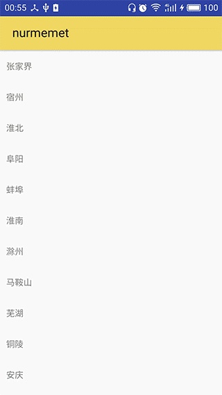
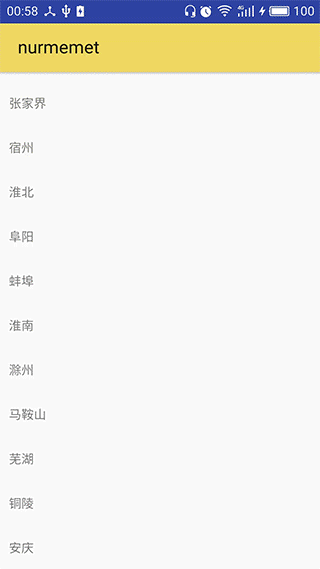

#CoordinateLayout


#####layout_scrollFlags属性值
下面RecycleView和CollapsingToolbarLayout为例
1. scroll   
跟着RecycleView向上滚动
2. enterAlways   
只要往下滑动，滑动的瞬间ToolBar就进入，如果不设置这个属性的等RecycleView往下滚动完不能再滚动的时候再次往下滑动RecycleView
CollapsingToolbarLayout才能进入
3. exitUntilCollapsed
当RecycleView向上滑动时CollapsingToolbarLayout收缩，Toolbar不会滚动消失 不设置此属性  
  
设置此属性之后  
  
4. enterAlwaysCollapsed  
布局文件如下
```xml
<?xml version="1.0" encoding="utf-8"?>
<android.support.design.widget.CoordinatorLayout
    xmlns:android="http://schemas.android.com/apk/res/android"
    xmlns:app="http://schemas.android.com/apk/res-auto"
    xmlns:tools="http://schemas.android.com/tools"
    android:layout_width="match_parent"
    android:layout_height="match_parent"
    android:orientation="vertical"
    tools:context="com.example.nurmemet.collapsingtoolbarlayout.MainActivity"
    >
    <android.support.design.widget.AppBarLayout
        android:layout_width="match_parent"
        android:layout_height="256dp"
        android:fitsSystemWindows="true"
        >

        <android.support.design.widget.CollapsingToolbarLayout
            android:id="@+id/collapsing_toolbar_layout"
            android:layout_width="match_parent"
            android:layout_height="256dp"
            android:minHeight="100dp"
            app:contentScrim="#30469b"
            app:expandedTitleMarginStart="48dp"
            app:layout_scrollFlags="scroll|enterAlways|enterAlwaysCollapsed|exitUntilCollapsed|"
            >

            <ImageView
                android:layout_width="match_parent"
                android:layout_height="match_parent"
                android:scaleType="centerCrop"
                android:src="@mipmap/tt"
                app:layout_collapseMode="parallax"
                app:layout_collapseParallaxMultiplier="0.7"
                />

            <android.support.v7.widget.Toolbar
                android:id="@+id/tool_bar"
                android:layout_width="match_parent"
                android:layout_height="?attr/actionBarSize"
                app:layout_collapseMode="pin"
                />

        </android.support.design.widget.CollapsingToolbarLayout>
    </android.support.design.widget.AppBarLayout>


    <android.support.v7.widget.RecyclerView
        android:id="@+id/recycle_view"
        android:layout_width="match_parent"
        android:layout_height="match_parent"
        app:layout_behavior="@string/appbar_scrolling_view_behavior"
        ></android.support.v7.widget.RecyclerView>

</android.support.design.widget.CoordinatorLayout>


```

此属性同时设置enterAlways，enterAlwaysCollapsed，minHeight的时候才生效，看下面的效果图  
  
分两次进入屏幕首先进入minHeiht部分再下面的滚动View(本例中的RecycleView)滚动完毕之后剩下的高度再进入屏幕

5. contentScrim
效果图如下当View收缩完毕时ToolBar的颜色效果图如下  
  
布局文件如下
```xml
<?xml version="1.0" encoding="utf-8"?>
<android.support.design.widget.CoordinatorLayout
    xmlns:android="http://schemas.android.com/apk/res/android"
    xmlns:app="http://schemas.android.com/apk/res-auto"
    xmlns:tools="http://schemas.android.com/tools"
    android:layout_width="match_parent"
    android:layout_height="match_parent"
    android:orientation="vertical"
    tools:context="com.example.nurmemet.collapsingtoolbarlayout.MainActivity"
    >
    <android.support.design.widget.AppBarLayout
        android:layout_width="match_parent"
        android:layout_height="256dp"
        android:fitsSystemWindows="true"
        >
        <!--黄色 app:contentScrim="#ecdc67"-->
        <android.support.design.widget.CollapsingToolbarLayout
            android:id="@+id/collapsing_toolbar_layout"
            android:layout_width="match_parent"
            android:layout_height="256dp"
            android:minHeight="100dp"
            app:contentScrim="#ecdc67"
            app:expandedTitleMarginStart="48dp"
            app:layout_scrollFlags="scroll|exitUntilCollapsed"
            >

            <ImageView
                android:layout_width="match_parent"
                android:layout_height="match_parent"
                android:scaleType="centerCrop"
                android:src="@mipmap/tt"
                app:layout_collapseMode="parallax"
                app:layout_collapseParallaxMultiplier="0.7"
                />

            <android.support.v7.widget.Toolbar
                android:id="@+id/tool_bar"
                android:layout_width="match_parent"
                android:layout_height="?attr/actionBarSize"
                app:layout_collapseMode="pin"
                />

        </android.support.design.widget.CollapsingToolbarLayout>
    </android.support.design.widget.AppBarLayout>


    <android.support.v7.widget.RecyclerView
        android:id="@+id/recycle_view"
        android:layout_width="match_parent"
        android:layout_height="match_parent"
        app:layout_behavior="@string/appbar_scrolling_view_behavior"
        ></android.support.v7.widget.RecyclerView>

</android.support.design.widget.CoordinatorLayout>


```


6. expandedTitleMarginStart
其实这个属性是CollapsingToolbarLayout完全展开完时title的PaddingLeft,如下图是expandedTitleMarginStart为0的时候  
  
如下图是expandedTitleMarginStart为100的时候  



