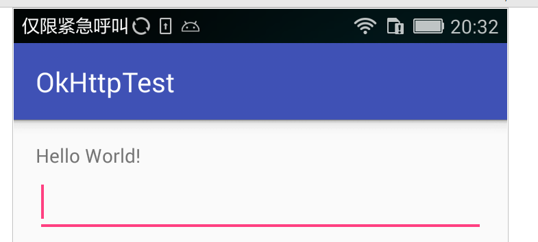
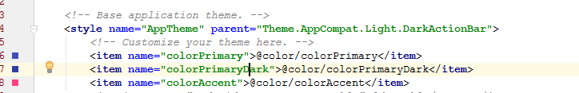
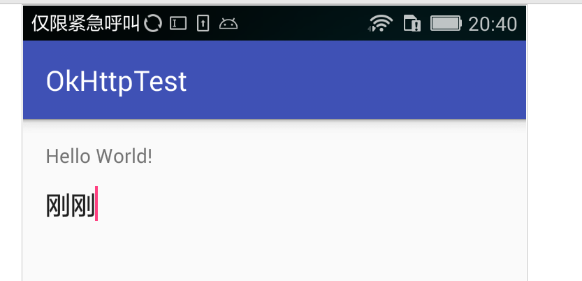
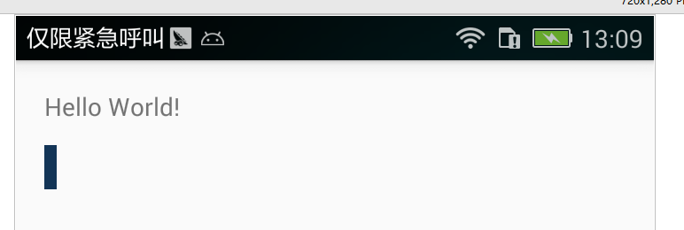

#EditText

* EditText背景

默认   
  
修改EditText背景

```xml
<resources>
    <!-- Base application theme. -->
    <style name="AppTheme" parent="Theme.AppCompat.Light.DarkActionBar">
        <!-- Customize your theme here. -->
        <item name="colorPrimary">@color/colorPrimary</item>
        <item name="colorPrimaryDark">@color/colorPrimaryDark</item>
        <item name="colorAccent">@color/colorAccent</item>
        <!--兼容5.0以下的系统-->
        <item name="editTextBackground">@android:color/transparent</item>
        <!--5.0以及以上的系统-->
        <item name="android:editTextBackground">@android:color/transparent</item>

    </style>

</resources>

```
修改后    
 

* EidtText光标颜色
```xml
<resources>
    <!-- Base application theme. -->
    <style name="AppTheme" parent="Theme.AppCompat.Light.NoActionBar">
        <!-- Customize your theme here. -->
        <item name="colorPrimary">@color/colorPrimary</item>
        <item name="colorPrimaryDark">@color/colorPrimaryDark</item>
        <item name="colorAccent">@color/colorAccent</item>
        <!--兼容5.0以下的系统-->
        <item name="editTextBackground">@android:color/transparent</item>
        <!--5.0以及以上的系统-->
        <item name="android:editTextBackground">@android:color/transparent</item>
        <!--兼容5.0以下的系统-->
        <item name="editTextStyle">@style/custom_eidt_text_style</item>
        <!--5.0以及以上的系统-->
        <item name="android:editTextStyle">@style/custom_eidt_text_style</item>
    </style>

    <style name="custom_eidt_text_style" parent="@style/Widget.AppCompat.EditText">
        <item name="android:textCursorDrawable">@drawable/cursor</item>
    </style>
</resources>

```
 
