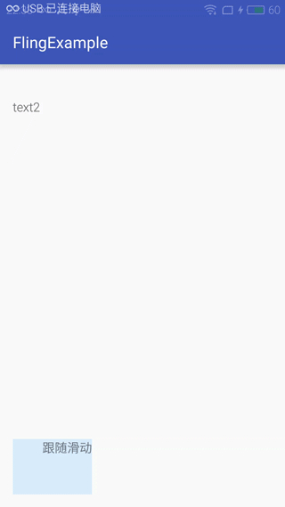

#android Fling操作的实现
先看看个效果图




当滑动NestedScrollView的时候TextView也跟着滑动，跟着fling

其实也很简单，Scroller的fling函数就可以实现，下面先看下fling函数的参数含义
```java
//startX 开始的时候的x坐标
//startY 开始的时候的y坐标
//velocityX 开始的时候的x轴方向的速度
//velocityY 开始的时候的y轴方向的速度，
//minX 如果是往左滑动，能够滑动的最小x轴坐标
//maxX 如果是往右滑动能够滑动的最大的x轴坐标
//minY 如果是往上滑动能够滑动的最小的y轴坐标
//maxY 如果是往下滑动能够滑动的最大y轴坐标
  public void fling(int startX, int startY, int velocityX, int velocityY,
            int minX, int maxX, int minY, int maxY) {
    }
```

下面是完整的代码
```java
package com.example.nurmemet.flingexample;

import android.content.Context;
import android.support.design.widget.CoordinatorLayout;
import android.support.v4.view.NestedScrollingParent;
import android.support.v4.view.ViewCompat;
import android.support.v4.widget.NestedScrollView;
import android.support.v4.widget.ScrollerCompat;
import android.util.AttributeSet;
import android.view.View;

/**
 * Created by nurmemet on 8/25/2016.
 * 嵌套滑动系统有三个部分组成，NestedScrollingParent 一般是CoordinatorLayout,target一般是NestedScrollingView,RecycleView,
 * 还有一个是带Behavior的View（必须是CoordinatorLayout 的直接子节点View，本例子中的跟随滑动 TextView）
 */
public class CustomBehavior extends CoordinatorLayout.Behavior<View> {
    private ScrollerCompat mScroller;
    private Runnable mFlingRunnable = null;

    public CustomBehavior(Context context, AttributeSet attrs) {
        super(context, attrs);
        mScroller = ScrollerCompat.create(context);
    }

    /**
     * 此处告诉嵌套滑动系统你要消化多少距离，dx,dy是即将滑动的距离
     */
    @Override
    public void onNestedPreScroll(CoordinatorLayout coordinatorLayout, View child, View target, int dx, int dy, int[] consumed) {
        super.onNestedPreScroll(coordinatorLayout, child, target, dx, dy, consumed);
        consumed[0] = dx / 2;
        consumed[1] = dy / 2;

    }

    /**
     * dxConsumed，dyConsumed是onNestedPreScroll函数中告诉系统你要消化的距离
     */
    @Override
    public void onNestedScroll(CoordinatorLayout coordinatorLayout, View child, View target, int dxConsumed, int dyConsumed, int dxUnconsumed, int dyUnconsumed) {
        child.offsetTopAndBottom(dyConsumed);
    }

    /**
     * Called when a descendant of the CoordinatorLayout attempts to initiate a nested scroll.
     * 当CoordinatorLayout的子节点View（本例子的中的NestedScrollView）开始嵌套滑动的时候执行此函数
     * <p/>
     * <p>Any Behavior associated with any direct child of the CoordinatorLayout may respond
     * to this event and return true to indicate that the CoordinatorLayout should act as
     * a nested scrolling parent for this scroll. Only Behaviors that return true from
     * this method will receive subsequent nested scroll events.</p>
     * 任何一个跟CoordinatorLayout直接字节点View关联的Behavior会响应这个此事件，并且返回true以表示CoordinatorLayout是这次滑动的scrolling parent
     * 并且只要返回true才接收到后续的嵌套滑动事件
     *
     * @param coordinatorLayout the CoordinatorLayout parent of the view this Behavior is
     *                          associated with
     * @param child             the child view of the CoordinatorLayout this Behavior is associated with
     * @param directTargetChild the child view of the CoordinatorLayout that either is or
     *                          contains the target of the nested scroll operation
     * @param target            the descendant view of the CoordinatorLayout initiating the nested scroll
     * @param nestedScrollAxes  the axes that this nested scroll applies to. See
     *                          {@link ViewCompat#SCROLL_AXIS_HORIZONTAL},
     *                          {@link ViewCompat#SCROLL_AXIS_VERTICAL}
     * @return true if the Behavior wishes to accept this nested scroll
     * 返回true表示这次嵌套滑动会被此View处理
     * @see NestedScrollingParent#onStartNestedScroll(View, View, int)
     * <p/>
     * 如果此处不返回true，onNestedScroll，onNestedPreScroll将不会接受任何滑动信息
     */
    @Override
    public boolean onStartNestedScroll(CoordinatorLayout coordinatorLayout, View child, View directTargetChild, View target, int nestedScrollAxes) {
        super.onStartNestedScroll(coordinatorLayout, child, directTargetChild, target, nestedScrollAxes);
        return true;
    }

    /**
     * 当onNestedPreFling返回true的时候此函数才能执行
     */
    @Override
    public boolean onNestedFling(CoordinatorLayout coordinatorLayout, View child, View target, float velocityX, float velocityY, boolean consumed) {
        NestedScrollView scrollView = (NestedScrollView) target;
        //去掉上下padding
        int height = scrollView.getHeight() - scrollView.getPaddingBottom() - scrollView.getPaddingTop();
        //scrollView中只有一个View，所以此处用getChildAt(0)，
        int bottom = scrollView.getChildAt(0).getHeight();
        //bottom-height就是ScrollView能够滑动的距离
        //minY是如果向上滑动，能够滑动的最小距离，maxY是如果向下滑动能够滑动的最大距离，minX,maxX也是同样的道理
        mScroller.fling(child.getLeft(), child.getTop(), (int) velocityX, (int) velocityY, 0, 0, coordinatorLayout.getPaddingTop(), Math.max(0, bottom - height));
        if (mFlingRunnable != null) {
            child.removeCallbacks(mFlingRunnable);
            mFlingRunnable = null;
        }
        if (mFlingRunnable == null) {
            mFlingRunnable = new FlingRunnable(coordinatorLayout, child);
            ViewCompat.postOnAnimation(child, mFlingRunnable);
        }
        return false;
    }


    /**
     * Called when a nested scrolling child is about to start a fling.
     * 当一个nested scrolling child (本例子中的NestedScrollView)即将开始fling的时候执行
     * <p>Any Behavior associated with the direct child of the CoordinatorLayout may elect
     * to accept the nested scroll as part of {@link #onStartNestedScroll}. Each Behavior
     * that returned true will receive subsequent nested scroll events for that nested scroll.
     * </p>
     * 任何一个CoordinatorLayout直接子节点View相关的Behavior会接受此事件，就像onStartNestedScroll一样
     * <p><code>onNestedPreFling</code> is called when the current nested scrolling child view
     * detects the proper conditions for a fling, but it has not acted on it yet. A
     * Behavior can return true to indicate that it consumed the fling. If at least one
     * Behavior returns true, the fling should not be acted upon by the child.</p>
     * 此函数你可以返回true仪表是你要消耗这次fling事件，这样nestedScrolling Chld View(本例子中的NestedScrollView将不会接受fling事件）
     *
     * @param coordinatorLayout the CoordinatorLayout parent of the view this Behavior is
     *                          associated with
     * @param child             the child view of the CoordinatorLayout this Behavior is associated with
     * @param target            the descendant view of the CoordinatorLayout performing the nested scroll
     * @param velocityX         horizontal velocity of the attempted fling
     * @param velocityY         vertical velocity of the attempted fling
     * @return true if the Behavior consumed the fling
     * @see NestedScrollingParent#onNestedPreFling(View, float, float)
     */
    @Override
    public boolean onNestedPreFling(CoordinatorLayout coordinatorLayout, View child, View target, float velocityX, float velocityY) {
        super.onNestedPreFling(coordinatorLayout, child, target, velocityX, velocityY);
        return false;
    }


    private class FlingRunnable implements Runnable {
        private final CoordinatorLayout mParent;
        private final View mLayout;

        FlingRunnable(CoordinatorLayout parent, View layout) {
            mParent = parent;
            mLayout = layout;
        }

        @Override
        public void run() {
            if (mLayout != null && mScroller != null) {
                if (mScroller.computeScrollOffset()) {
                    ViewCompat.offsetTopAndBottom(mLayout, mScroller.getCurrY() - mLayout.getTop());
                    ViewCompat.postOnAnimation(mLayout, this);
                } else {
                    onFlingFinished(mParent, mLayout);
                }
            }
        }
    }


    void onFlingFinished(CoordinatorLayout parent, View layout) {
        // no-op
    }


}

```

布局文件
```xml
<?xml version="1.0" encoding="utf-8"?>
<android.support.design.widget.CoordinatorLayout
    xmlns:android="http://schemas.android.com/apk/res/android"
    xmlns:app="http://schemas.android.com/apk/res-auto"
    xmlns:tools="http://schemas.android.com/tools"
    android:layout_width="match_parent"
    android:layout_height="match_parent"
    android:paddingBottom="@dimen/activity_vertical_margin"
    android:paddingLeft="@dimen/activity_horizontal_margin"
    android:paddingRight="@dimen/activity_horizontal_margin"
    android:paddingTop="@dimen/activity_vertical_margin"
    tools:context="com.example.nurmemet.flingexample.MainActivity"
    >

    <android.support.v4.widget.NestedScrollView
        android:layout_width="match_parent"
        android:layout_height="match_parent"

        >

        <LinearLayout
            android:layout_width="match_parent"
            android:layout_height="match_parent"
            android:orientation="vertical"
            >

            <TextView
                android:layout_width="match_parent"
                android:layout_height="500dp"
                android:text="text1"
                />

            <TextView
                android:layout_width="match_parent"
                android:layout_height="500dp"
                android:text="text2"
                />
        </LinearLayout>

    </android.support.v4.widget.NestedScrollView>

    <TextView
        android:layout_width="100dp"
        android:layout_height="100dp"
        android:background="#220099FF"
        android:gravity="right"
        android:text="跟随滑动"
        app:layout_behavior=".CustomBehavior"
        />
</android.support.design.widget.CoordinatorLayout>


```


activity
```java
package com.example.nurmemet.flingexample;

import android.support.v7.app.AppCompatActivity;
import android.os.Bundle;

public class MainActivity extends AppCompatActivity {

    @Override
    protected void onCreate(Bundle savedInstanceState) {
        super.onCreate(savedInstanceState);

        setContentView(R.layout.activity_main);
    }
}

```