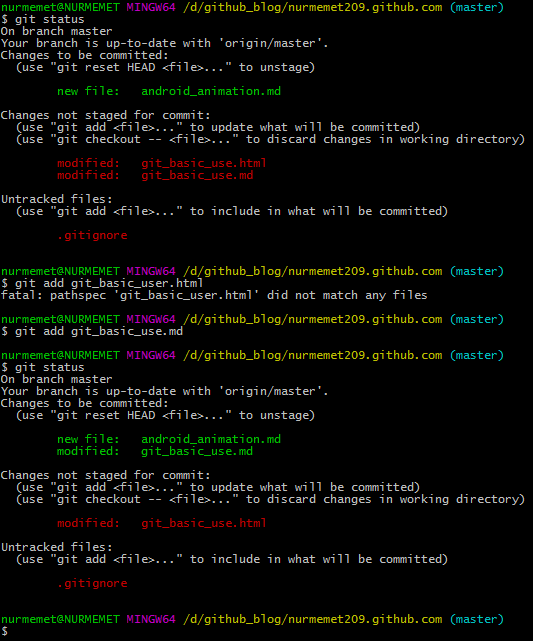

#git 基本操作

* 远程分支同步到本地
```git
git checkout  branchName
```

* 新建分支
```git
git branch branchName
```

* 同步到远程服务器
```git
git push origin branchName
```

* 列出本地分支
```git
git branch 
//带星号的是当前分支
```


* 分支切换
```git
git checkout branchName
```

* 将某个分支合并到master
```git 
//先用 git checkout master 命令切换到master分支 然后用如下命令
git merge branchName

```

* 放弃某个文件本地修改
```git
//git checkout index.html
git checkout file-name;
```
* 本地修改提交到服务器
首先查看更改
```git
git status

```
然后暂存
```git
//git add index.html
git add file-name
```
提交本地仓库
```git
//git commit -m first(是注释)
git commit -m notes
```
最后提交到远程仓库
```git
git push origin 
```

还有一种是首先用git status 命令查看更改然后用 git commit -a 命令提交所有更改到本地仓库，然后用 git push origin 提交到远程仓库
* git 取消跟踪某个文件
```git
//git reset HEAD android_animation.md
$ git reset HEAD file-name
```
* 添加到git 跟踪
```git
//git add android-animation.md
git add file-name
```

  
其实 git提示说的很清楚了已经   
changes to be commited:
changes not staged for commited:
untracked files:

git 操作流程是先用 如果是untracked files（是没被添加到git的文件） 用git add file-name 命令添加到暂存区，如果是changes to be commited 的文件用git add file-name 命令添加到暂存区或者用git checkout 命令覆盖本地更改，如果是git changes to be commited文件那么用命令 git commit -m notes(是注释) 来提交到本地仓库，再用git push origin命令提交远程仓库
* git commit
可以用git commit -m notes(是注释) 提交到本地仓库，如果忘了后面的-m notes 而用git commit 命令git 会打开Vim让你输入
notes 你可输入notes 再按Esc键进入命令模式再输入:wq保存并返回shell，，此时已经陈功提交到远程仓库

