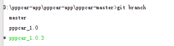

#git 基本操作

远程分支同步到本地
```git
git checkout  branchName
```

新建分支
```git
git branch branchName
```

同步到远程服务器
```git
git push origin branchName
```

列出本地分支
```git
git branch 
//带星号的是当前分支
```


分支切换
```git
git checkout branchName
```

将某个分支合并到master
```git 
//先用 git checkout master 命令切换到master分支 然后用如下命令
git merge branchName

```