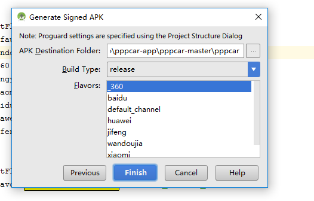
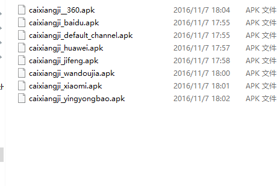

#gralde 基本

* 生成两个安装包  
有的时候需要测试apk跟在线正式版本同时安装到手机方便对比  
只修改下面的applicatonId就可以了，要修改应用名称可以修改mainfest.xml的application label标签
```groovy

 defaultConfig {
        applicationId "com.cn.pppcar"
        minSdkVersion minSdkVersion_
        targetSdkVersion targetSdkVersion_
        versionCode pppcar_version_Code
        versionName pppcar_version_Name
        multiDexEnabled true

    }
```


* gradle 多渠道打包
```xml
 <meta-data
            android:name="UMENG_CHANNEL"
            android:value="${UMENG_CHANNEL_VALUE}"
            />
```

每次打包的时候把把上面的UMENG_CHANNEL_VALUE换成渠道名称，友盟统计根据此值分开统计各个渠道报的下载量
```groovy
   defaultConfig {
        applicationId "com.cn.pppcar"
        minSdkVersion minSdkVersion_
        targetSdkVersion targetSdkVersion_
        versionCode pppcar_version_Code
        versionName pppcar_version_Name
        multiDexEnabled true
        manifestPlaceholders = [UMENG_CHANNEL_VALUE: "default_channel"]

    }

    productFlavors {
        default_channel {}
        wandoujia {}
        _360 {}
        yingyongbao {}
        xiaomi {}
        baidu {}
        huawei {}
        jifeng {}
    }

    productFlavors.all { flavor ->
        flavor.manifestPlaceholders = [UMENG_CHANNEL_VALUE: name]

    }


```

```groovy

//下面代码的作用给每次生成的apk起对应的名字，此段代码不在android{}当中，是最外面
android.applicationVariants.all { variant ->
    variant.outputs.each { output ->
        def outputFile = output.outputFile
        if (outputFile != null && outputFile.name.endsWith('.apk')) {
            File outputDirectory = new File(outputFile.parent);
            def fileName
            if (variant.buildType.name == "release") {
//                    fileName = "app_v${defaultConfig.versionName}_${packageTime()}_${variant.productFlavors[0].name}.apk"
                fileName = "caixiangji_${variant.productFlavors[0].name}.apk"
            } else {
//                    fileName = "app_v${defaultConfig.versionName}_${packageTime()}_beta.apk"
                fileName = "caixiangji_${variant.productFlavors[0].name}_beta.apk"
            }
            output.outputFile = new File(outputDirectory, fileName)
        }
    }
}


```

可以单个生成某个渠道的安装包  
  
也可以用命令行生成单个渠道app  
gradlew assembleWandoujiaRelease
也可以批量生成安装包，android studio terminal 输入  
gradlew assembleRelease  
  


*  提高gradle编译速度  
项目根目录下的gradle.properties文件夹内容如下,根目录下的gradle.properties文件的优先级高于单个moudle的gradle.properties文件的优先级

```properties
org.gradle.configureondemand=true
org.gradle.daemon=true
android.useDeprecatedNdk=true
org.gradle.jvmargs=-Xmx4096m -XX:MaxPermSize=2048m -XX:+HeapDumpOnOutOfMemoryError -Dfile.encoding=UTF-8
org.gradle.parallel=true


```

* 多渠道打包美团解决方案
[多渠道打包](http://tech.meituan.com/mt-apk-adaptation.html)
* 另一种更快捷的多渠道打包方式
[zip写入comment的方式写入实现多渠道打包](https://github.com/seven456/MultiChannelPackageTool)