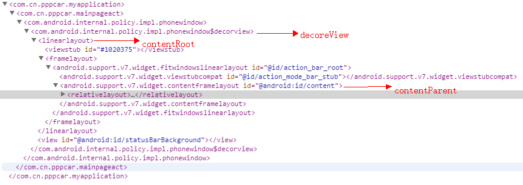

#pppcar android客户端启动速度优化


启动速度优化其实也就对以下几个方面的调整
* 延迟加载

是因为有些初始化操作是必须的，比如说，如果你的项目中用到Fresco，那Fresco使用之前肯定要初始化的，还有一些
第三方库都是建议在Application的OnCreate方法里面初始化但是OnCreate里面的操作太耗时的话就会导致app启动速度
明显变慢，是因为Application的OnCreate方法之前窗口都还没创建所以此时还没用户界面，app启动图一般都是放本地的
你可以把启动图设置为启动Activity的windowbackground，然后在启动图等待时间去初始化那些第三方库效果会好点
* 启动图设置为window的backgound

```xml

  <!-- Base application theme. -->
    <style name="AppTheme" parent="Theme.AppCompat.Light.NoActionBar">
        <!-- Customize your theme here. -->
        <item name="colorPrimary">@color/colorPrimary</item>
        <item name="colorPrimaryDark">@color/colorPrimaryDark</item>
        <item name="colorAccent">@color/colorAccent</item>
        <item name="android:background">@android:color/transparent</item>
        <item name="android:windowNoTitle">true</item>
        <item name="android:windowBackground">@mipmap/setup</item>
    </style>

```

backgournd设置为透明这样可以防止过度绘制，background应该是decoreView的背景，windowBackground是窗口背景
其实这个方法不会提高启动速度，只是给用户的感觉启快了点，比较友好

* 控制图片的大小

是因为图片图像操作本身也是比较耗时的，所以适当的去控制图像大小也是一个办法
* 布局优化

布局嵌套太多也会导致界面渲染慢，关于布局优化我会令写篇文章专门讲述再次大家知道复杂布局对app启动也有影响就可以。
这里顺便讲下activity的布局结构，布局结构可以用facebook的一个插件就可以看得到，官网 [http://facebook.github.io/stetho/](http://facebook.github.io/stetho/) ,还有这个布局结构也不是固定的，它是根据窗口的属性去加载布局（源码 PhoneWindow generateLayout函数）





