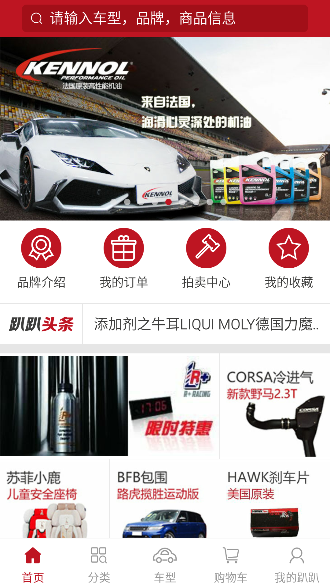

#pppcar android客户端statusbarcolor

* windowFullscreen 属性  
隐藏状态栏，可以下拉状态栏显示，状态栏显示半透明  
      
下拉显示状态栏，半透明状态栏

* statusBarColor

* windowTranslucentNavigation
底部虚拟按你区域背景，比如nexus5

* navigationBarColor

* windowTranslucentStatus

* windowLightStatusBar
