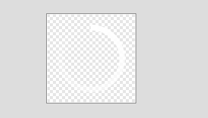
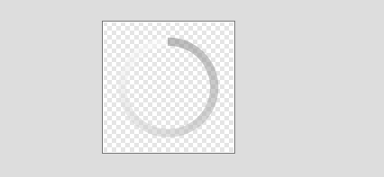

#progressBar
    
* themes_material 主题下实现 

themes_material.xml
```xml
<item name="progressBarStyle">@style/Widget.Material.ProgressBar</item>
```

styles_material.xml
```xml
 <style name="Widget.Material.ProgressBar" parent="Widget.ProgressBar">
        <item name="indeterminateDrawable">@drawable/progress_medium_material</item>
</style>
```

progress_medium_material.xml
```xml
<animated-vector xmlns:android="http://schemas.android.com/apk/res/android"
    android:drawable="@drawable/vector_drawable_progress_bar_medium" >

    <target
        android:name="progressBar"
        android:animation="@anim/progress_indeterminate_material" />

    <target
        android:name="root"
        android:animation="@anim/progress_indeterminate_rotation_material" />

</animated-vector>
```


vector_drawable_progress_bar_medium.xml
```xml
<vector xmlns:android="http://schemas.android.com/apk/res/android"
        android:height="48dp"
        android:width="48dp"
        android:viewportHeight="48"
        android:viewportWidth="48"
        android:tint="?attr/colorControlActivated">

    <group
        android:name="root"
        android:translateX="24.0"
        android:translateY="24.0" >
        <path
            android:name="progressBar"
            android:fillColor="#00000000"
            android:pathData="M0, 0 m 0, -18 a 18,18 0 1,1 0,36 a 18,18 0 1,1 0,-36"
            android:strokeColor="@color/white"
            android:strokeLineCap="square"
            android:strokeLineJoin="miter"
            android:strokeWidth="4"
            android:trimPathEnd="0"
            android:trimPathOffset="0"
            android:trimPathStart="0" />
    </group>

</vector>
```

progress_indeterminate_material.xml
```xml

<set xmlns:android="http://schemas.android.com/apk/res/android" >

    <objectAnimator
        android:duration="1333"
        android:interpolator="@interpolator/trim_start_interpolator"
        android:propertyName="trimPathStart"
        android:repeatCount="-1"
        android:valueFrom="0"
        android:valueTo="0.75"
        android:valueType="floatType" />
    <objectAnimator
        android:duration="1333"
        android:interpolator="@interpolator/trim_end_interpolator"
        android:propertyName="trimPathEnd"
        android:repeatCount="-1"
        android:valueFrom="0"
        android:valueTo="0.75"
        android:valueType="floatType" />
    <objectAnimator
        android:duration="1333"
        android:interpolator="@android:anim/linear_interpolator"
        android:propertyName="trimPathOffset"
        android:repeatCount="-1"
        android:valueFrom="0"
        android:valueTo="0.25"
        android:valueType="floatType" />

</set>

```

progress_indeterminate_rotation_material.xml
```xml
<objectAnimator xmlns:android="http://schemas.android.com/apk/res/android"
    android:duration="4444"
    android:interpolator="@android:anim/linear_interpolator"
    android:propertyName="rotation"
    android:repeatCount="-1"
    android:valueFrom="0"
    android:valueTo="720"
android:valueType="floatType" />
```


* themes_holo 主题下实现 

themes_holo.xml
```xml
 <item name="progressBarStyle">@style/Widget.Holo.ProgressBar</item>
```

styles_holo.xml
```xml
 <style name="Widget.Holo.ProgressBar" parent="Widget.ProgressBar">
        <item name="indeterminateDrawable">@drawable/progress_medium_holo</item>
</style>
```

progress_medium_holo.xml
```xml
<layer-list xmlns:android="http://schemas.android.com/apk/res/android">
    <item>
        <rotate
             android:drawable="@drawable/spinner_48_outer_holo"
             android:pivotX="50%"
             android:pivotY="50%"
             android:fromDegrees="0"
             android:toDegrees="1080" />
    </item>
    <item>
        <rotate
             android:drawable="@drawable/spinner_48_inner_holo"
             android:pivotX="50%"
             android:pivotY="50%"
             android:fromDegrees="720"
             android:toDegrees="0" />
    </item>
</layer-list>
```



