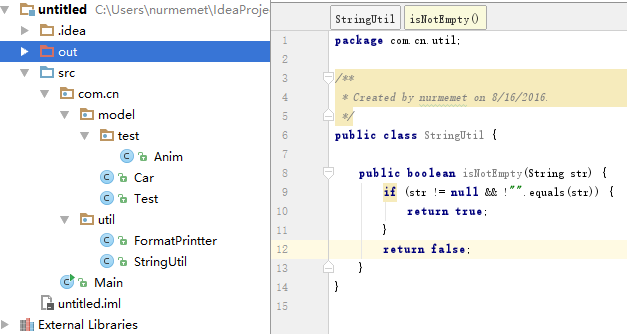
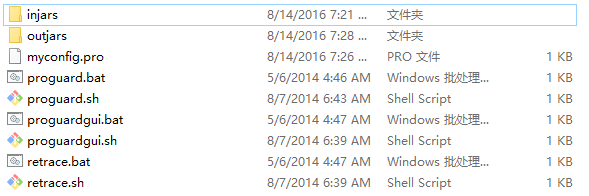
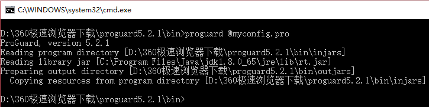
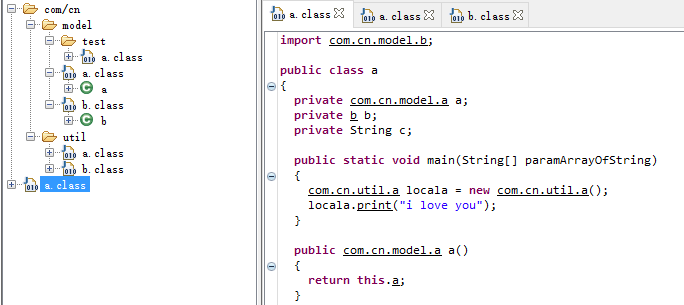

#proguard 代码混淆
首先下载proguard 官网可以下载 http://proguard.sourceforge.net/
左侧的菜单栏里面有downloads菜单点进去就是下载页面 [下载地址](http://101.96.10.73/downloads.sourceforge.net/project/proguard/proguard/5.2/proguard5.2.1.zip?r=https%3A%2F%2Fsourceforge.net%2Fprojects%2Fproguard%2Ffiles%2F&ts=1471169282&use_mirror=nchc)
下载解压之后，进入bin目录，打开命令提示符 就可以使用proguard 命令
下面用一个控制台程序演示proguard 代码混淆
控制台程序源码目录结构如下



编译完之后目录结构也是一样的，在proguard的bin目录下创建inajars目录，用于存放要混淆的类以及jar文件，创建outjars文件用于存放混淆后的代码创建myconfig.pro文件，用于编写混淆规则，刚才编译完之后的工程拷贝到injars目录下，此时bin目录结构如下




用记事本打开myconfig.pro文件编写混淆规则
``` proguard
#要输入的文件目录,可以用多个-injars命令
-injars injars  
#混淆后的代码输出目录
-outjars outjars  
#library不参与混淆，是工程用到的依赖库，可以使用多个-libraryjars 来引入外部库
#-libraryjars 'C:\Program Files\Java\jdk1.8.0_65\jre\lib\lib2.jar'  这样
#-libraryjars 'C:\Program Files\Java\jdk1.8.0_65\jre\lib\lib1.jar'  这样
-libraryjars 'C:\Program Files\Java\jdk1.8.0_65\jre\lib\rt.jar'

#不要压缩
-dontshrink
#不要优化
-dontoptimize
#保证 有相同名称的类成员用同样的符号混淆，不同名称的类成员用不同符号混淆
#（这里指的是多个类之间）
-useuniqueclassmembernames
#保留包名称
-keeppackagenames
#保留Main.class（只保留类名称不保证类成员）,注意这个地方必须要用类全限定名（包括包），而且混淆规则-keep命令是必须的
#如果是控制台程序你得保留带main函数的class ,如果是library得保留所有的公开方法，
-keep public class Main
#保留类com.cn.util.StringUtil名称以及所有类成员
-keep class com.cn.util.StringUtil{*;}
#混淆不要用大小写来区分类名称，是因为windows系统不区分文件名大小写，所以这个选项得开启
-dontusemixedcaseclassnames
#包com.cn.model里面所有的包里面的和com.cn.model包里面的所有的类名称以及类成员都保留
#本例子中它会保留所有com.cn.model包里面的类以及com.cn.model.test包里面的所有的类
-keep class com.cn.model.**{*;}


```
控制台执行 proguard @myconfig.pro 命令



此时outjars目录如下


对比下四个类混淆之前和混淆混淆之后
Car.java 混淆之前
```java
package com.cn.model;
public class Car{
    public String getCar() {
        return car;
    }

    public void setCar(String car) {
        this.car = car;
    }

    public String car;

    public void outCar(String car){
        System.out.println(car);
    }
}

```
Car.java混淆之后
```java
package com.cn.model;

import java.io.PrintStream;

public class Car
{
  public String car;
  
  public String getCar()
  {
    return this.car;
  }
  
  public void setCar(String paramString)
  {
    this.car = paramString;
  }
  
  public void outCar(String paramString)
  {
    System.out.println(paramString);
  }
}

```
Test.java混淆之前
```java
package com.cn.model;

public class Test{

    public String getTest() {
        return test;
    }

    public void setTest(String test) {
        this.test = test;
    }

    public String test;
    
    public void outTest(String test){
        System.out.println(test);
    }
}

```
Test.java 混淆之后
```java
package com.cn.model;

import java.io.PrintStream;

public class Test
{
  public String test;
  
  public String getTest()
  {
    return this.test;
  }
  
  public void setTest(String paramString)
  {
    this.test = paramString;
  }
  
  public void outTest(String paramString)
  {
    System.out.println(paramString);
  }
}


```

Anim.java混淆之前
```java
package com.cn.model.test;

import java.io.PrintStream;

public class Anim
{
  public String name;
  
  public String getName()
  {
    return this.name;
  }
  
  public void setName(String paramString)
  {
    this.name = paramString;
  }
  
  public void eat(String paramString)
  {
    System.out.println(paramString);
  }
}

```

Anim.java混淆之后
```java
package com.cn.model.test;

import java.io.PrintStream;

public class Anim
{
  public String name;
  
  public String getName()
  {
    return this.name;
  }
  
  public void setName(String paramString)
  {
    this.name = paramString;
  }
  
  public void eat(String paramString)
  {
    System.out.println(paramString);
  }
}


```
FormatPrinter.java混淆之前
```java
package com.cn.util;

/**
 * Created by nurmemet on 8/14/2016.
 */
public class FormatPrintter {
    public String name;

    public String getName() {
        return name;
    }

    public void setName(String name) {
        this.name = name;
    }

    public void print(String str){
        System.out.println(str);
    }
}


```
FormatPrinter.java混淆之后
```java
package com.cn.util;

import java.io.PrintStream;

public class a
{
  public String name;
  
  public String getName()
  {
    return this.name;
  }
  
  public void setName(String paramString)
  {
    this.name = paramString;
  }
  
  public void print(String paramString)
  {
    System.out.println(paramString);
  }
}


```

StringUtil.java 混淆之前
```java
package com.cn.util;

/**
 * Created by nurmemet on 8/16/2016.
 */
public class StringUtil {

    public boolean isNotEmpty(String str) {
        if (str != null && !"".equals(str)) {
            return true;
        }
        return false;
    }
}

```

StringUtil.java 混淆之后
```java
package com.cn.util;

public class StringUtil
{
  public boolean isNotEmpty(String paramString)
  {
    return (paramString != null) && (!"".equals(paramString));
  }
}

```

Main.java混淆之前
```java
import com.cn.model.Car;
import com.cn.model.Test;
import com.cn.util.FormatPrintter;

public class Main {
    private Car mCar;
    private Test mTest;
    private String mStr;

    public static void main(String[] args) {
        FormatPrintter printer = new FormatPrintter();
        printer.print("i love you");
    }
    
    public Car getmCar() {
        return mCar;
    }

    public void setmCar(Car mCar) {
        this.mCar = mCar;
    }

    public Test getmTest() {
        return mTest;
    }

    public void setmTest(Test mTest) {
        this.mTest = mTest;
    }

    public String getmStr() {
        return mStr;
    }

    public void setmStr(String mStr) {
        this.mStr = mStr;
    }


}


```

Main.java混淆之后
```java
import com.cn.model.Car;
import com.cn.model.Test;
import com.cn.util.a;

public class Main
{
  private Car a;
  private Test b;
  private String c;
  
  public static void main(String[] paramArrayOfString)
  {
    a locala = new a();
    locala.print("i love you");
  }
  
  public Car a()
  {
    return this.a;
  }
  
  public void a(Car paramCar)
  {
    this.a = paramCar;
  }
  
  public Test b()
  {
    return this.b;
  }
  
  public void a(Test paramTest)
  {
    this.b = paramTest;
  }
  
  public String c()
  {
    return this.c;
  }
  
  public void a(String paramString)
  {
    this.c = paramString;
  }
}


```


下面看看其他命令
* -keepclassmembers

```proguard

#要输入的文件目录,可以用多个-injars命令
-injars injars  
#混淆后的代码输出目录
-outjars outjars  
#library不参与混淆，是工程用到的依赖库，可以使用多个-libraryjars 来引入外部库
#-libraryjars 'C:\Program Files\Java\jdk1.8.0_65\jre\lib\lib2.jar'  这样
#-libraryjars 'C:\Program Files\Java\jdk1.8.0_65\jre\lib\lib1.jar'  这样
-libraryjars 'C:\Program Files\Java\jdk1.8.0_65\jre\lib\rt.jar'

#不要压缩
-dontshrink
#不要优化
-dontoptimize
#保证 有相同名称的类成员用同样的符号混淆，不同名称的类成员用不同符号混淆
#（这里指的是多个类之间）
-useuniqueclassmembernames
#保留包名称
-keeppackagenames
#指定要保留的类成员
-keepclassmembers class **{
    public java.lang.String getTest() ;
}


```

混淆之后



```java
import com.cn.model.b;

public class a
{
  private com.cn.model.a a;
  private b b;
  private String c;
  
  public static void main(String[] paramArrayOfString)
  {
    com.cn.util.a locala = new com.cn.util.a();
    locala.print("i love you");
  }
  
  public com.cn.model.a a()
  {
    return this.a;
  }
  
  public void a(com.cn.model.a parama)
  {
    this.a = parama;
  }
  
  public b b()
  {
    return this.b;
  }
  
  public void a(b paramb)
  {
    this.b = paramb;
  }
  
  public String c()
  {
    return this.c;
  }
  
  public void a(String paramString)
  {
    this.c = paramString;
  }
}


```