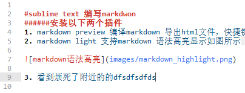

#sublime text 编写markdwon 
######安装以下两个插件
1. markdown preview 编译markdown 导出html文件，快捷键ctrl+B编译，markdown文件同一个目录下生成[markdown文件名].html的文件，markdownpreview本身不支持语法高亮显示
2. markdown light 支持markdown 语法高亮显示如图所示 

