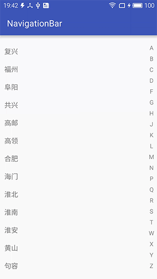

#字母滑动定位控件开发
[github地址](https://github.com/nurmemet209/NavigationBar)  
实现原理很简单，先上个图看看效果




知识点  
* 触摸事件的处理
```java
@Override
    public boolean onTouchEvent(MotionEvent event) {

        final float x = event.getX();
        final float y = event.getY();

        int pos = -1;
        String letter;
        int adapterPos;
        switch (event.getActionMasked()) {
            case MotionEvent.ACTION_DOWN: {
                //判断触摸点是否在navigationContainer里面
                if (!mChildRect.contains(x, y)) {
                    return false;
                }
                bacgroundIn();
                pos = (int) (y - mNavigationContainer.getPaddingTop() - mNavigationContainer.getTop()) / getLetterHeight();
                mPosition = pos;
                letter = mAbcList.get(mPosition);
                adapterPos = mAbcMap.get(letter);
                mToastView.setText(letter);
                scroll2Position(adapterPos, mRecycleView);
            }

            break;
            case MotionEvent.ACTION_MOVE:
                pos = (int) (y - mNavigationContainer.getPaddingTop() - mNavigationContainer.getTop()) / getLetterHeight();
                System.out.println("pos=" + pos);
                if (pos != mPosition) {
                    letter = mAbcList.get(pos);
                    adapterPos = mAbcMap.get(letter);
                    scroll2Position(adapterPos, mRecycleView);
                    mToastView.setText(letter);
                }
                mPosition = pos;
                break;
            case MotionEvent.ACTION_UP:
            case MotionEvent.ACTION_CANCEL:
                backgroundOut();
                mPosition = -1;
                break;
            default:
                break;
        }
        return true;
    }
```

* 代码实现圆角矩形背景
```java
 private Drawable getToastViewBackground(){
        //用两个参数表示一个角的角度（有点像椭圆表示方法）
        RoundRectShape shape=new RoundRectShape(new float[]{16,16,16,16,16,16,16,16},null,null);
        ShapeDrawable shapeDrawable=new ShapeDrawable(shape);
        Paint p=shapeDrawable.getPaint();
        p.setColor(Color.BLACK);
        p.setAlpha(navigationMaxAlpha);
        p.setStyle(Paint.Style.FILL);
        ;
        return shapeDrawable;
    }
```

* navigationbar高度（测量）
```java
 @Override
    protected void onMeasure(int widthMeasureSpec, int heightMeasureSpec) {
        super.onMeasure(widthMeasureSpec, heightMeasureSpec);
        if (mNavigationContainer != null) {
            int parentHeight = getMeasuredHeight();
            //先给字母控件给个固定的高度，如果，总的高度超出父控件，根据父控件的高度平均分配字母控件的高度，进行重新测量
            if (parentHeight < mAbcList.size() * mLetterItemHeight) {
                int height = parentHeight / mAbcList.size();
                int specWidth = MeasureSpec.makeMeasureSpec(mNavigationWidth, MeasureSpec.EXACTLY);
                int specHeight = MeasureSpec.makeMeasureSpec(height, MeasureSpec.EXACTLY);
                for (int i = 0; i < mAbcList.size(); i++) {
                    mNavigationContainer.getChildAt(i).measure(specWidth, specHeight);
                }
            }
        }
    }
```

* RecyclerView滑动到指定的位置
```java
 private void scroll2Position(int index, RecyclerView recyclerView) {
        LinearLayoutManager manager = (LinearLayoutManager) recyclerView.getLayoutManager();
        int firstPosition = manager.findFirstVisibleItemPosition();
        int lastPosition = manager.findLastVisibleItemPosition();
        if (index <= firstPosition) {
            manager.scrollToPosition(index);
        } else if (index <= lastPosition) {
            int top = recyclerView.getChildAt(index - firstPosition).getTop();
            recyclerView.scrollBy(0, top);
        } else {
            //让指定的Index出于可见状态并且index与布局开始点（默认是(0,0)点）的距离为0
            manager.scrollToPositionWithOffset(index, 0);
        }
    }
```
